---
**Document:** SmartMeal Application Debugging Strategy  
**Project:** SmartMeal - Meal Planning & Recipe Management Application  
**Version:** 1.0  
**Status:** Design Phase  
**Last Updated:** January 2025  
**Author:** System Architect  
**Purpose:** Comprehensive debugging and error handling design for full-stack Next.js application  
---

# SmartMeal Application Debugging Strategy

## 1. Overview

### 1.1 Purpose
This document defines a comprehensive debugging and error handling strategy for the SmartMeal full-stack application. The strategy encompasses intelligent logging across API endpoints, visible error boundaries in UI components, diagnostic utilities, and testing mechanisms to ensure robust error detection and user-friendly error presentation.

### 1.2 Problem Statement
The current application lacks:
- Detailed logging at API endpoints to trace request/response cycles
- Visible error messages when pages or components fail to load
- User-friendly notifications for missing resources (e.g., recipe not found)
- Structured error detection for broken links and API failures
- Centralized debugging utilities for consistent logging across the application

### 1.3 Goals
- Implement comprehensive logging at all API entry, processing, and exit points
- Add visible error boundaries to prevent blank screens on component failures
- Create user-friendly error messages for common failure scenarios
- Develop reusable debug utilities with colored console output
- Establish global error handling mechanisms
- Provide testing utilities for API route validation

### 1.4 Scope
**In Scope:**
- API route logging enhancements (`/api/recipes/search`, `/api/recipes/[id]`)
- UI error boundary components for all major pages
- Client-side fetch error handling
- Debug utility library creation
- API route testing mechanisms
- Error logging patterns and standards

**Out of Scope:**
- Production log aggregation services (e.g., Sentry, LogRocket)
- Performance monitoring and profiling
- Database-level error handling (application uses static JSON data)
- Authentication/authorization error flows

---

## 2. Technology Stack Context

### 2.1 Application Architecture
| Layer | Technology | Version |
|-------|-----------|---------|
| Framework | Next.js (App Router) | 16.0.0 |
| Language | TypeScript | Strict mode |
| Styling | Tailwind CSS | v4 |
| Runtime | Node.js | - |
| Data Source | Static JSON files | - |

### 2.2 Existing Error Handling Components
- **ErrorBoundary Component**: Located at `components/common/ErrorBoundary.tsx`
  - Currently implements React class-based error boundary
  - Provides basic fallback UI with error details
  - Not globally integrated across all pages

---

## 3. Error Logging Architecture

### 3.1 Debug Utility Design

#### 3.1.1 Core Debug Logger Module
Create a centralized debug utility module at `lib/debug.ts` with the following capabilities:

**Module Characteristics:**
- Colored console output for visual differentiation
- Context-aware logging with component/module identification
- Severity levels (INFO, WARN, ERROR, DEBUG)
- Timestamp inclusion
- Structured object logging
- Environment-aware (verbose in development, minimal in production)

**Log Level Definitions:**

| Level | Purpose | Color Convention | Production Behavior |
|-------|---------|------------------|---------------------|
| DEBUG | Detailed debugging information | Gray/Dim | Suppressed |
| INFO | General informational messages | Blue | Minimal |
| WARN | Warning conditions | Yellow | Logged |
| ERROR | Error conditions | Red | Logged with stack trace |
| SUCCESS | Successful operations | Green | Suppressed |

**Logging Interface Structure:**

```
Logger Function Parameters:
- context: string (e.g., "API:RecipeSearch", "Component:RecipeDetail")
- message: string (descriptive message)
- data?: object (optional structured data)
- level: LogLevel (DEBUG | INFO | WARN | ERROR | SUCCESS)
```

#### 3.1.2 Security and Privacy Guidelines
**Data Sanitization Rules:**
- Never log sensitive user data (passwords, tokens, personal information)
- Sanitize IDs and paths before logging
- Log only non-sensitive request parameters
- Use placeholders for sensitive fields (e.g., `[TOKEN_REDACTED]`)

---

## 4. API Error Vocabulary and Response Standards

### 4.1 Standard Error Response Format

#### 4.1.1 Error Response Structure
All API errors must follow a consistent structure for predictable client-side handling.

**Standard Error Response Schema:**

```
Error Response Object:
  - error: string (user-friendly message)
  - code: string (machine-readable error code)
  - statusCode: number (HTTP status code)
  - details?: object (additional context, dev only)
  - timestamp: ISO 8601 string
  - requestId?: string (for tracing)
```

#### 4.1.2 HTTP Status Code Mapping

| Status Code | Category | When to Use | User Message Pattern |
|-------------|----------|-------------|----------------------|
| 400 | Bad Request | Invalid input, missing required fields | "Please check your input and try again" |
| 404 | Not Found | Resource doesn't exist | "We couldn't find what you're looking for" |
| 422 | Unprocessable Entity | Valid format but semantic errors | "The data provided cannot be processed" |
| 429 | Too Many Requests | Rate limit exceeded | "Too many requests. Please wait a moment" |
| 500 | Internal Server Error | Unexpected server error | "Something went wrong on our end" |
| 503 | Service Unavailable | Temporary unavailability | "Service is temporarily unavailable" |

#### 4.1.3 Error Code Taxonomy

**Error Code Format**: `DOMAIN_ERROR_TYPE_DETAIL`

| Error Code | HTTP Status | Scenario | User Message | Resolution Flow |
|------------|-------------|----------|--------------|------------------|
| `RECIPE_NOT_FOUND_INVALID_ID` | 404 | Recipe ID doesn't exist | "Recipe not found. Try browsing our collection." | Redirect to search |
| `RECIPE_SEARCH_INVALID_INPUT` | 400 | Empty or malformed ingredients | "Please enter at least one ingredient." | Show inline validation |
| `RECIPE_SEARCH_NO_RESULTS` | 200 | Valid search, no matches | "No recipes match your search." | Suggest broadening filters |
| `RECIPE_FILE_READ_ERROR` | 500 | Cannot read recipes.json | "We're having trouble loading recipes." | Retry with exponential backoff |
| `RECIPE_FILE_PARSE_ERROR` | 500 | Malformed JSON | "Recipe data is corrupted." | Alert admin, show cached data |
| `RECIPE_VALIDATION_FAILED` | 422 | Recipe data schema mismatch | "Recipe data is invalid." | Log details, return generic error |
| `FILTER_INVALID_CUISINE` | 400 | Unsupported cuisine type | "Please select a valid cuisine." | Show available cuisines |
| `FILTER_INVALID_DIETARY` | 400 | Unsupported dietary filter | "Please select valid dietary filters." | Show available filters |

#### 4.1.4 Sample Error Responses

**400 Bad Request Example:**
```
{
  "error": "Please enter at least one ingredient to search.",
  "code": "RECIPE_SEARCH_INVALID_INPUT",
  "statusCode": 400,
  "details": {
    "field": "ingredients",
    "received": [],
    "expected": "Non-empty array of strings"
  },
  "timestamp": "2025-01-15T10:30:45.123Z"
}
```

**404 Not Found Example:**
```
{
  "error": "Recipe not found. It may have been removed or the link is incorrect.",
  "code": "RECIPE_NOT_FOUND_INVALID_ID",
  "statusCode": 404,
  "details": {
    "requestedId": "abc123",
    "suggestion": "Try browsing our recipe collection"
  },
  "timestamp": "2025-01-15T10:30:45.123Z"
}
```

**500 Internal Server Error Example:**
```
{
  "error": "We're having trouble loading recipes. Please try again in a moment.",
  "code": "RECIPE_FILE_READ_ERROR",
  "statusCode": 500,
  "details": {
    "internalMessage": "ENOENT: no such file or directory",
    "path": "/data/recipes.json"
  },
  "timestamp": "2025-01-15T10:30:45.123Z",
  "requestId": "req_xyz789"
}
```

### 4.2 Error Resolution Flow Mapping

#### 4.2.1 Client-Side Error Resolution Decision Tree

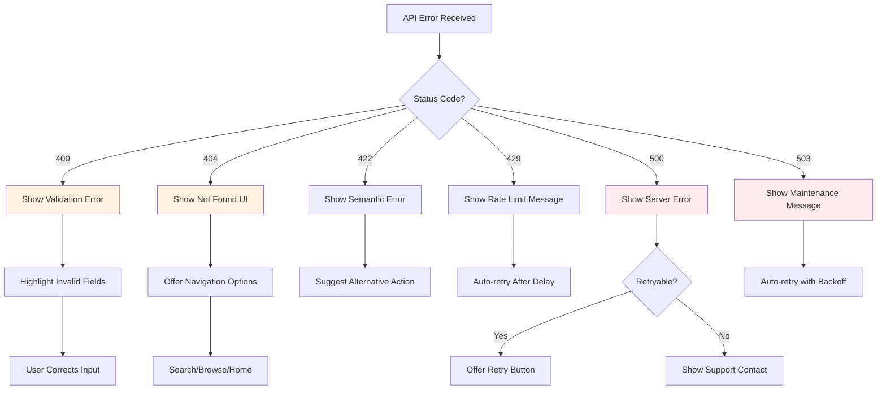
```mermaid
graph TD
    A[API Error Received] --> B{Status Code?}
    B -->|400| C[Show Validation Error]
    C --> D[Highlight Invalid Fields]
    D --> E[User Corrects Input]
    
    B -->|404| F[Show Not Found UI]
    F --> G[Offer Navigation Options]
    G --> H[Search/Browse/Home]
    
    B -->|422| I[Show Semantic Error]
    I --> J[Suggest Alternative Action]
    
    B -->|429| K[Show Rate Limit Message]
    K --> L[Auto-retry After Delay]
    
    B -->|500| M[Show Server Error]
    M --> N{Retryable?}
    N -->|Yes| O[Offer Retry Button]
    N -->|No| P[Show Support Contact]
    
    B -->|503| Q[Show Maintenance Message]
    Q --> R[Auto-retry with Backoff]
    
    style C fill:#fff3e0
    style F fill:#fff3e0
    style M fill:#ffebee
    style Q fill:#ffebee
```

#### 4.2.2 Resolution Flow Table

| Error Type | Immediate UI Action | User Action Suggested | Background Behavior | Logging Priority |
|------------|---------------------|----------------------|---------------------|------------------|
| 400 Validation | Inline error message | Correct input fields | None | INFO |
| 404 Not Found | Empty state with guidance | Browse/search alternatives | Cache miss logged | WARN |
| 422 Semantic | Modal with explanation | Review and resubmit | Log validation details | WARN |
| 429 Rate Limit | Toast notification | Wait message displayed | Auto-retry in 60s | WARN |
| 500 Server Error | Error boundary fallback | Retry button shown | Log full error + context | ERROR |
| 503 Unavailable | Maintenance banner | Automatic retry countdown | Exponential backoff | ERROR |
| Network Error | Offline indicator | Check connection | Queue failed requests | ERROR |

---

## 5. API Route Logging Strategy

### 5.1 API Logging Requirements

#### 4.1.1 Logging Points
Each API route must implement logging at the following stages:

**Lifecycle Logging Structure:**

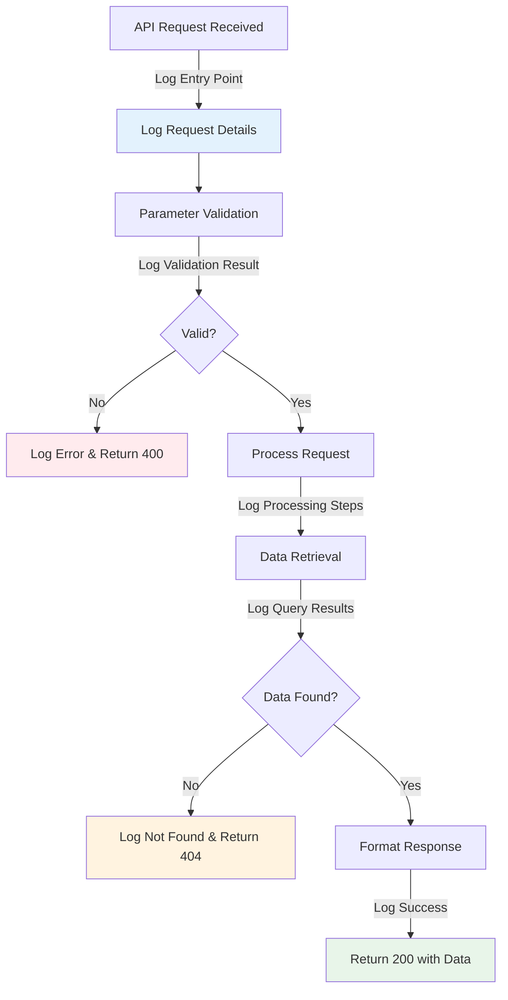
```mermaid
graph TD
    A[API Request Received] -->|Log Entry Point| B[Log Request Details]
    B --> C[Parameter Validation]
    C -->|Log Validation Result| D{Valid?}
    D -->|No| E[Log Error & Return 400]
    D -->|Yes| F[Process Request]
    F -->|Log Processing Steps| G[Data Retrieval]
    G -->|Log Query Results| H{Data Found?}
    H -->|No| I[Log Not Found & Return 404]
    H -->|Yes| J[Format Response]
    J -->|Log Success| K[Return 200 with Data]
    
    style B fill:#e3f2fd
    style E fill:#ffebee
    style I fill:#fff3e0
    style K fill:#e8f5e9
```

#### 4.1.2 Entry Point Logging
**Information to Log:**
- HTTP method and full route path
- Timestamp of request
- Request parameters (query, body, path params)
- Client information (if available via headers)

**Example Log Structure for Entry:**
```
[INFO] [API:RecipeSearch] Request received
  - Timestamp: 2025-01-15T10:30:45.123Z
  - Method: POST
  - Ingredients: ["tomato", "garlic", "pasta"]
  - Filters: { cuisine: "Italian", dietaryFilters: ["vegetarian"] }
```

#### 4.1.3 Processing Logging
**Information to Log:**
- Number of recipes loaded from data source
- Search/filter operations applied
- Intermediate match results
- Performance metrics (optional: time taken for operations)

**Example Log Structure for Processing:**
```
[DEBUG] [API:RecipeSearch] Processing search
  - Total recipes loaded: 150
  - Ingredient matching completed: 45 matches found
  - After filters applied: 12 recipes remaining
```

#### 4.1.4 Exit Point Logging
**Information to Log:**
- Response status code
- Response data summary (count, not full payload)
- Total processing time
- Success/failure indication

**Example Log Structure for Exit:**
```
[SUCCESS] [API:RecipeSearch] Response sent
  - Status: 200
  - Recipes returned: 12
  - Processing time: 45ms
```

#### 4.1.5 Error Logging
**Information to Log:**
- Error type and message
- Stack trace (in development)
- Request context that led to error
- Error recovery attempts

**Example Log Structure for Error:**
```
[ERROR] [API:RecipeSearch] Request failed
  - Error: Failed to parse JSON file
  - Message: Unexpected token in JSON at position 1234
  - Request context: { ingredients: [...] }
  - Stack: [stack trace in development only]
```

### 4.2 Specific API Route Enhancements

#### 4.2.1 Recipe Search Endpoint (`/api/recipes/search`)

**Enhanced Logging Flow:**

| Stage | Log Level | Information to Capture |
|-------|-----------|------------------------|
| Request Entry | INFO | POST method, ingredients array, filters object |
| Validation | WARN (if invalid) | Missing/invalid ingredients, validation errors |
| File Loading | DEBUG | File path, number of recipes loaded |
| Search Execution | DEBUG | Search parameters, initial match count |
| Filter Application | DEBUG | Filters applied, remaining count after each filter |
| Sorting | DEBUG | Sort option, final ordered result count |
| Response | SUCCESS/ERROR | Status code, result count, processing time |

**Specific Logging Points:**
1. Log incoming request body structure
2. Log validation failures with specific field errors
3. Log file system operations (reading recipes.json)
4. Log search algorithm results at each filtering stage
5. Log final matched recipe IDs (not full objects)
6. Log response structure before sending

#### 4.2.2 Recipe Detail Endpoint (`/api/recipes/[id]`)

**Enhanced Logging Flow:**

| Stage | Log Level | Information to Capture |
|-------|-----------|------------------------|
| Request Entry | INFO | GET method, recipe ID parameter |
| ID Extraction | DEBUG | Raw ID from params, normalized ID |
| File Loading | DEBUG | File path, total recipes in dataset |
| Recipe Lookup | DEBUG | Search result (found/not found), matching strategy |
| Not Found | WARN | ID that was not found, available IDs sample |
| Response | SUCCESS/ERROR | Status code, recipe title (if found) |

**Specific Logging Points:**
1. Log the extracted ID parameter
2. Log ID type and format (string/number comparison)
3. Log sample recipe IDs from dataset for comparison
4. Log the exact matching logic being used
5. If not found, log a sample of available IDs for debugging
6. Log recipe title and basic metadata (not full object)

---

## 6. Advanced UI Error Boundaries

### 6.1 Error Boundary Architecture

#### 6.1.1 Multi-Level Error Boundary Strategy

**Boundary Hierarchy:**

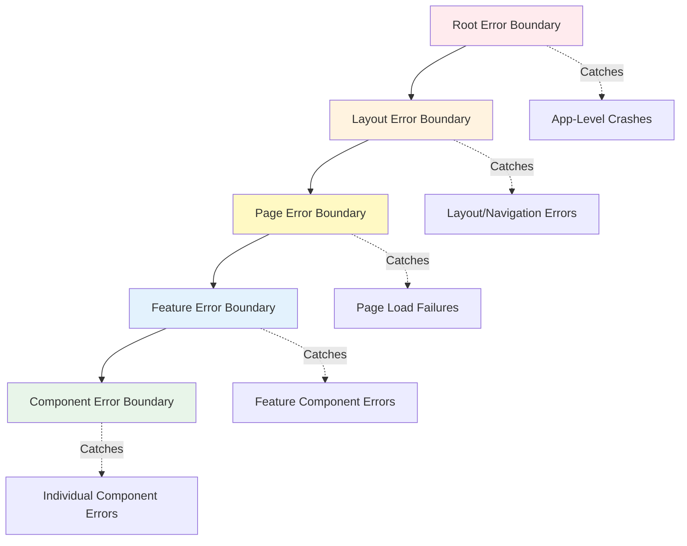
```mermaid
graph TD
    A[Root Error Boundary] --> B[Layout Error Boundary]
    B --> C[Page Error Boundary]
    C --> D[Feature Error Boundary]
    D --> E[Component Error Boundary]
    
    A -.->|Catches| F[App-Level Crashes]
    B -.->|Catches| G[Layout/Navigation Errors]
    C -.->|Catches| H[Page Load Failures]
    D -.->|Catches| I[Feature Component Errors]
    E -.->|Catches| J[Individual Component Errors]
    
    style A fill:#ffebee
    style B fill:#fff3e0
    style C fill:#fff9c4
    style D fill:#e3f2fd
    style E fill:#e8f5e9
```

#### 6.1.2 Error Boundary Placement Strategy

| Boundary Level | Location | Granularity | Fallback UI Scope | Example |
|----------------|----------|-------------|-------------------|----------|
| **Root** | `app/layout.tsx` | Application-wide | Full page replacement | Unhandled promise rejections |
| **Layout** | `app/(layout)/layout.tsx` | Section-wide | Navigation preserved | Sidebar component crash |
| **Page** | Each page component | Page-wide | Page content only | Recipe detail page error |
| **Feature** | Major feature components | Feature-wide | Feature component only | Search filter panel error |
| **Component** | Critical components | Component-wide | Component only | Recipe card rendering error |

#### 6.1.3 Recommended Component Wrapping Strategy

**High-Priority Components (Must Wrap):**
- Recipe detail page (`app/recipes/[id]/page.tsx`)
- Search results grid (`components/recipes/RecipeGrid.tsx`)
- Favorites list (`app/favorites/page.tsx`)
- Meal planner calendar (`app/planner/page.tsx`)
- Dashboard widgets (`components/dashboard/*`)

**Medium-Priority Components (Should Wrap):**
- Navigation components
- Filter panels
- Data visualization charts
- Third-party integrations (YouTube embeds)

**Low-Priority Components (Optional Wrap):**
- Simple UI components (buttons, badges)
- Static content sections
- Pure presentational components

### 6.2 Error Origin-Specific User Experience

#### 6.2.1 Network Error Presentation

**What User Sees:**

```
UI Display:
┌─────────────────────────────────────────┐
│  🌐 Connection Error                     │
│                                          │
│  Unable to connect to the server.        │
│  Please check your internet connection.  │
│                                          │
│  [Retry]  [Go to Homepage]               │
└─────────────────────────────────────────┘
```

**Technical Details (Dev Mode):**
- Error Type: `NetworkError`
- Fetch URL: `/api/recipes/search`
- Method: `POST`
- Payload: `{ ingredients: [...] }`
- Browser: `navigator.onLine: false`

**User Actions Available:**
- Retry button (attempts fetch again)
- Navigate to homepage
- Automatically retry when connection restored

#### 6.2.2 Parse Error Presentation

**What User Sees:**

```
UI Display:
┌─────────────────────────────────────────┐
│  ⚠️ Data Format Error                    │
│                                          │
│  We received invalid data from the       │
│  server. This has been reported.         │
│                                          │
│  [Try Again]  [Contact Support]          │
└─────────────────────────────────────────┘
```

**Technical Details (Dev Mode):**
- Error Type: `SyntaxError: Unexpected token`
- Source: `JSON.parse()` in API response handler
- Response Preview: `<!DOCTYPE html>...` (HTML instead of JSON)
- Expected: JSON object with `{ recipes: [...] }`

**Logged Information:**
```
[ERROR] [Page:RecipeDetail] JSON parse failed
  → Response type: text/html (expected: application/json)
  → Status: 200
  → Body preview: "<!DOCTYPE html><html>..."
  → Likely cause: Server returned error page instead of JSON
```

#### 6.2.3 Not Found Error Presentation

**What User Sees:**

```
UI Display:
┌─────────────────────────────────────────┐
│  🔍 Recipe Not Found                     │
│                                          │
│  The recipe you're looking for doesn't   │
│  exist or has been removed.              │
│                                          │
│  Recipe ID: abc123                       │
│                                          │
│  [Search Recipes]  [Browse All]          │
└─────────────────────────────────────────┘
```

**Technical Details (Dev Mode):**
- Error Type: `NotFoundError`
- Requested ID: `abc123`
- API Response: `404`
- Available IDs Sample: `["recipe-001", "recipe-002", ...]`
- ID Format: String comparison used

**Logged Information:**
```
[WARN] [API:RecipeDetail] Recipe not found
  → Requested ID: "abc123"
  → ID type: string
  → Total recipes in dataset: 150
  → Sample valid IDs: ["recipe-001", "recipe-002", "recipe-003"]
  → Possible match: None
```

#### 6.2.4 Missing Environment Variable Error Presentation

**What User Sees:**

```
UI Display:
┌─────────────────────────────────────────┐
│  🔧 Configuration Error                  │
│                                          │
│  The application is not properly         │
│  configured. Please contact support.     │
│                                          │
│  Error Code: ENV_MISSING                 │
│                                          │
│  [Reload Page]                           │
└─────────────────────────────────────────┘
```

**Technical Details (Dev Mode):**
- Error Type: `ConfigurationError`
- Missing Variable: `NEXT_PUBLIC_API_BASE_URL`
- Required By: API fetch utility
- Current Value: `undefined`
- Environment: `development`

**Logged Information:**
```
[ERROR] [Config] Missing required environment variable
  → Variable: NEXT_PUBLIC_API_BASE_URL
  → Required by: lib/api.ts
  → Current env: development
  → Action required: Add to .env.local file
  → Documentation: docs/SETUP.md#environment-variables
```

#### 6.2.5 Hydration Mismatch Error Presentation

**What User Sees:**

```
UI Display:
┌─────────────────────────────────────────┐
│  ⚡ Rendering Issue Detected             │
│                                          │
│  The page had a temporary rendering      │
│  issue but should still work normally.   │
│                                          │
│  If problems persist, try refreshing.    │
│                                          │
│  [Dismiss]  [Refresh Page]               │
└─────────────────────────────────────────┘
```

**Technical Details (Dev Mode):**
- Error Type: `HydrationMismatchError`
- Component: `RecipeCard`
- Server HTML: `<div>15 minutes</div>`
- Client HTML: `<div>15 min</div>`
- Cause: Date/time formatting differs between server and client

**Logged Information:**
```
[WARN] [Hydration] Mismatch detected
  → Component: RecipeCard
  → Property: prepTime display
  → Server rendered: "15 minutes"
  → Client expected: "15 min"
  → Common cause: localStorage/Date usage in render
  → Fix: Use useEffect for client-only values
```

### 6.3 Error Boundary Component Specifications

#### 6.3.1 Root Error Boundary (`app/layout.tsx`)

**Capabilities:**
- Catches all unhandled errors in application
- Logs error to external service (production)
- Provides full-page fallback UI
- Offers app reload option

**Fallback UI Features:**
- Large, clear error icon
- Non-technical error message
- Error ID for support reference
- Reload and homepage navigation buttons
- Error details collapsible (dev only)

#### 6.3.2 Page Error Boundary (Per-Page)

**Capabilities:**
- Catches errors specific to page component
- Preserves navigation/header
- Logs page context (route, params)
- Provides page-level fallback

**Fallback UI Features:**
- Contextual error message ("Unable to load [page name]")
- Preserved site navigation
- Alternative navigation options
- Retry button for page reload

#### 6.3.3 Feature Error Boundary (Major Components)

**Capabilities:**
- Catches errors in specific features
- Allows rest of page to function
- Logs feature context
- Provides inline fallback

**Fallback UI Features:**
- Small error indicator in feature area
- "This feature is temporarily unavailable" message
- Rest of page remains functional
- Optional feature reload button

### 6.4 Error Boundary Implementation Pattern

#### 6.4.1 Error Boundary Props Structure

**Props Interface (Conceptual):**

```
ErrorBoundaryProps:
  - children: ReactNode
  - fallback?: ReactNode | ((error: Error) => ReactNode)
  - onError?: (error: Error, errorInfo: ErrorInfo) => void
  - level?: "root" | "page" | "feature" | "component"
  - resetKeys?: any[] (trigger reset when changed)
  - resetOnPropsChange?: boolean
```

#### 6.4.2 Error Context Information

**Information Captured on Error:**

| Field | Source | Purpose |
|-------|--------|----------|
| `errorMessage` | `error.message` | Display to developer |
| `errorStack` | `error.stack` | Debug trace (dev only) |
| `componentStack` | `errorInfo.componentStack` | Identify failing component |
| `route` | `window.location.pathname` | Context of error |
| `timestamp` | `new Date().toISOString()` | When error occurred |
| `userAgent` | `navigator.userAgent` | Browser/device info |
| `viewport` | `window.innerWidth/Height` | Screen size context |

---

## 7. Recipe ID Validation and Fuzzy Matching

### 7.1 Recipe ID Error Prevention

#### 7.1.1 Common ID Mismatch Scenarios

| Issue Type | Example | Cause | Detection Method |
|------------|---------|-------|------------------|
| Case Sensitivity | `Recipe-001` vs `recipe-001` | Inconsistent casing | Lowercase comparison |
| Off-by-One | `recipe-150` requested, only 149 exist | Index miscalculation | Range validation |
| Prefix Mismatch | `rec-001` vs `recipe-001` | Multiple ID formats | Prefix normalization |
| Suffix Variation | `recipe-001.json` vs `recipe-001` | File extension included | Extension stripping |
| Whitespace | `recipe-001 ` vs `recipe-001` | Copy-paste errors | Trim before comparison |
| URL Encoding | `recipe%2D001` vs `recipe-001` | Encoded special chars | URL decode before use |

#### 7.1.2 ID Normalization Pipeline

**Normalization Steps:**

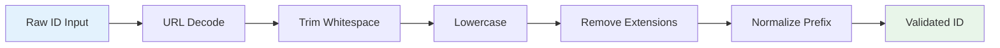
```mermaid
graph LR
    A[Raw ID Input] --> B[URL Decode]
    B --> C[Trim Whitespace]
    C --> D[Lowercase]
    D --> E[Remove Extensions]
    E --> F[Normalize Prefix]
    F --> G[Validated ID]
    
    style A fill:#e3f2fd
    style G fill:#e8f5e9
```

**Normalization Function (Conceptual):**

```
ID Normalization Process:
1. Input: "Recipe-001.json "
2. URL decode: "Recipe-001.json " (no change)
3. Trim: "Recipe-001.json"
4. Lowercase: "recipe-001.json"
5. Remove extension: "recipe-001"
6. Normalize prefix: "recipe-001"
7. Output: "recipe-001"
```

#### 7.1.3 Fuzzy Matching Strategy

**Matching Algorithm Priority:**

1. **Exact Match** (highest priority)
   - Direct string equality after normalization
   - Return immediately if found

2. **Case-Insensitive Match**
   - Compare lowercased versions
   - Log warning if case differs

3. **Prefix Match**
   - Try common prefixes: `recipe-`, `rec-`, `r-`
   - Append to input and retry

4. **Numeric Extraction**
   - Extract numbers from ID: `recipe-001` → `1`
   - Try format variations: `001`, `1`, `0001`

5. **Levenshtein Distance** (optional)
   - Find closest match within edit distance of 2
   - Suggest similar IDs to user

#### 7.1.4 Auto-Correction and Suggestion Flow

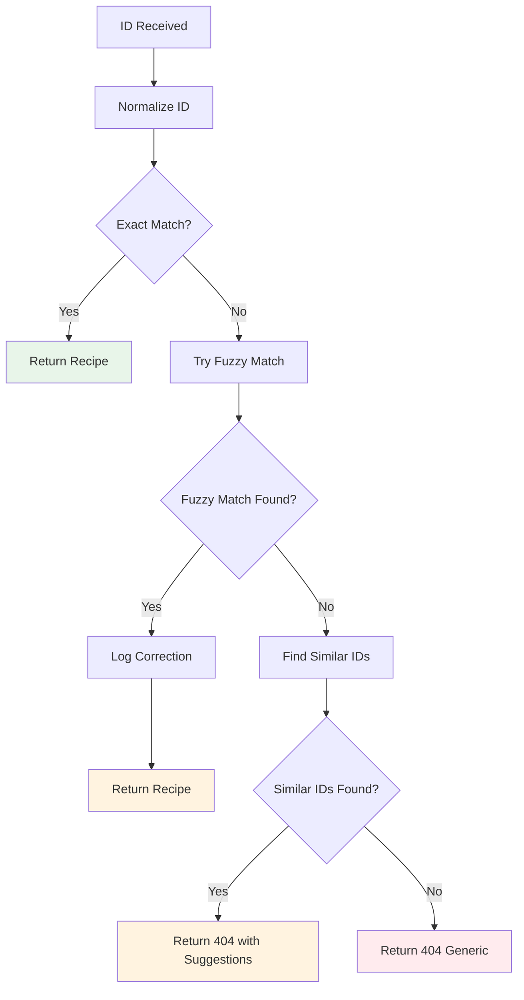
```mermaid
graph TD
    A[ID Received] --> B[Normalize ID]
    B --> C{Exact Match?}
    C -->|Yes| D[Return Recipe]
    C -->|No| E[Try Fuzzy Match]
    E --> F{Fuzzy Match Found?}
    F -->|Yes| G[Log Correction]
    G --> H[Return Recipe]
    F -->|No| I[Find Similar IDs]
    I --> J{Similar IDs Found?}
    J -->|Yes| K[Return 404 with Suggestions]
    J -->|No| L[Return 404 Generic]
    
    style D fill:#e8f5e9
    style H fill:#fff3e0
    style K fill:#fff3e0
    style L fill:#ffebee
```

#### 7.1.5 ID Suggestion Response Format

**404 Response with Suggestions:**

```
{
  "error": "Recipe not found",
  "code": "RECIPE_NOT_FOUND_INVALID_ID",
  "statusCode": 404,
  "details": {
    "requestedId": "recpe-001",
    "normalizedId": "recpe-001",
    "suggestions": [
      {
        "id": "recipe-001",
        "title": "Classic Margherita Pizza",
        "similarity": 0.92,
        "reason": "Similar ID pattern"
      },
      {
        "id": "recipe-011",
        "title": "Pepperoni Pizza",
        "similarity": 0.85,
        "reason": "Numeric similarity"
      }
    ]
  }
}
```

### 7.2 ID Validation Logging

#### 7.2.1 ID Processing Log Example

```
[DEBUG] [API:RecipeDetail] ID validation started
  → Raw ID: "Recipe-001.json "
  → After decode: "Recipe-001.json "
  → After trim: "Recipe-001.json"
  → After lowercase: "recipe-001.json"
  → After extension removal: "recipe-001"
  → Normalized ID: "recipe-001"
  → Exact match: Found
  → Recipe title: "Classic Margherita Pizza"
```

#### 7.2.2 Fuzzy Match Log Example

```
[WARN] [API:RecipeDetail] Fuzzy match applied
  → Requested ID: "recpe-001"
  → Normalized ID: "recpe-001"
  → Exact match: Not found
  → Fuzzy match attempt: Trying prefix variations
  → Match found: "recipe-001" (edit distance: 1)
  → Auto-correction applied: recpe-001 → recipe-001
  → Consider: Update links to use correct ID format
```

---

## 8. Network Request Monitoring and External Tools

### 8.1 Production Error Tracking Integration

#### 8.1.1 Recommended Tools Comparison

| Tool | Best For | Pricing Model | Key Features | SmartMeal Use Case |
|------|----------|---------------|--------------|--------------------|
| **Sentry** | Comprehensive error tracking | Free tier + paid | Error aggregation, release tracking, performance monitoring | Backend API errors, frontend crashes |
| **LogRocket** | Session replay + logs | Paid (free trial) | Video replay, console logs, network logs | User experience debugging |
| **Next.js Analytics** | Next.js specific metrics | Vercel tier-based | Web Vitals, real user monitoring | Performance tracking |
| **Datadog** | Full-stack observability | Paid (free trial) | APM, logs, infrastructure monitoring | Production deployment monitoring |
| **New Relic** | Application performance | Free tier + paid | Transaction tracing, error rates | API performance bottlenecks |

#### 8.1.2 Sentry Integration Strategy

**When to Use Sentry:**
- Production error aggregation
- Error rate alerting
- Release tracking and regression detection
- User impact analysis

**Integration Points:**

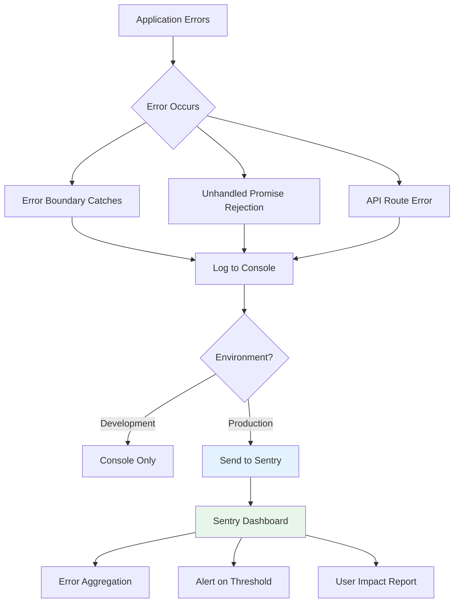
```mermaid
graph TD
    A[Application Errors] --> B{Error Occurs}
    B --> C[Error Boundary Catches]
    B --> D[Unhandled Promise Rejection]
    B --> E[API Route Error]
    
    C --> F[Log to Console]
    D --> F
    E --> F
    
    F --> G{Environment?}
    G -->|Development| H[Console Only]
    G -->|Production| I[Send to Sentry]
    
    I --> J[Sentry Dashboard]
    J --> K[Error Aggregation]
    J --> L[Alert on Threshold]
    J --> M[User Impact Report]
    
    style I fill:#e3f2fd
    style J fill:#e8f5e9
```

**Sentry Configuration (Conceptual):**

```
Sentry Setup:
  - DSN: environment variable NEXT_PUBLIC_SENTRY_DSN
  - Environment: development | staging | production
  - Release: Git commit SHA or version number
  - Sample Rate: 100% errors, 10% transactions
  - Ignore Patterns:
    - Development localhost errors
    - Known third-party script errors
    - Browser extension errors
```

**Error Context Sent to Sentry:**

| Context Field | Value | Purpose |
|---------------|-------|----------|
| `user.id` | Anonymized user identifier | Track per-user errors |
| `tags.page` | Current page route | Filter by page |
| `tags.feature` | Feature component name | Group by feature |
| `extra.recipeId` | Recipe ID (if applicable) | Debug recipe-specific errors |
| `extra.searchQuery` | Search parameters | Debug search issues |
| `breadcrumbs` | User action trail | Understand error context |

#### 8.1.3 LogRocket Integration Strategy

**When to Use LogRocket:**
- Reproducing user-reported bugs
- Understanding user journey before error
- Debugging UI/UX issues
- Network request inspection

**Captured Information:**
- Video replay of user session
- Console logs (all levels)
- Network requests and responses
- Redux/state changes (if applicable)
- DOM mutations and interactions

**Privacy Considerations:**

| Data Type | Handling |
|-----------|----------|
| User input | Sanitize password/credit card fields |
| API responses | Mask sensitive data |
| Console logs | Filter out tokens and keys |
| Network requests | Exclude authentication headers |

#### 8.1.4 Next.js Analytics Integration

**Built-in Metrics Tracked:**
- **Core Web Vitals:**
  - LCP (Largest Contentful Paint)
  - FID (First Input Delay)
  - CLS (Cumulative Layout Shift)
- **Custom Events:**
  - Recipe search performed
  - Recipe viewed
  - Favorite added
  - Error encountered

**Analytics Event Structure:**

```
Analytics Event:
  - name: "recipe_search_error"
  - category: "error"
  - label: "No results found"
  - value: search_query_length
  - metadata:
    - ingredients: ["tomato", "pasta"]
    - filters: { cuisine: "Italian" }
    - resultCount: 0
```

### 8.2 Browser DevTools Integration

#### 8.2.1 Network Tab Enhancements

**Custom Headers for Debugging:**

| Header Name | Value | Purpose |
|-------------|-------|----------|
| `X-Request-ID` | UUID | Trace request across logs |
| `X-Debug-Context` | Component name | Identify request origin |
| `X-User-Action` | Action type | Track user intent |
| `X-Timestamp` | ISO 8601 | Request timing |

**Example Network Tab Entry:**

```
Request:
  URL: /api/recipes/search
  Method: POST
  Status: 200
  Headers:
    X-Request-ID: req_abc123xyz
    X-Debug-Context: Page:SearchPage
    X-User-Action: recipe_search
    X-Timestamp: 2025-01-15T10:30:45.123Z
  
Payload:
  {
    "ingredients": ["tomato", "pasta"],
    "filters": { "cuisine": "Italian" }
  }

Response:
  {
    "recipes": [...],
    "count": 12,
    "meta": {
      "processingTime": "78ms",
      "requestId": "req_abc123xyz"
    }
  }
```

#### 8.2.2 Console Logging Best Practices

**Grouping Related Logs:**

```
Console Output Example:

▼ [API:RecipeSearch] Request lifecycle
    [INFO] Request initiated
      → Ingredients: ["tomato", "pasta"]
      → Filters: {cuisine: "Italian"}
    [DEBUG] Recipes loaded: 150
    [DEBUG] After matching: 45 recipes
    [DEBUG] After filters: 12 recipes
    [SUCCESS] Response sent (78ms)
```

**Performance Timing Marks:**

```
Performance Markers:
  search_start: 0ms
  recipes_loaded: 23ms
  matching_complete: 45ms
  filters_applied: 62ms
  search_end: 78ms
  
Total: 78ms
```

### 8.3 Error Monitoring Dashboard Design

#### 8.3.1 Key Metrics to Track

| Metric | Calculation | Alert Threshold | Action |
|--------|-------------|-----------------|--------|
| Error Rate | (Errors / Total Requests) × 100 | > 5% | Investigate immediately |
| 404 Rate | (404s / Total Requests) × 100 | > 2% | Check for broken links |
| Average Response Time | Sum(response times) / Count | > 1000ms | Optimize slow endpoints |
| Failed Search Rate | (Empty results / Total searches) × 100 | > 50% | Review search algorithm |
| Error Diversity | Unique error types | > 10 new types/day | Review new error patterns |

#### 8.3.2 Real-Time Monitoring Views

**Dashboard Sections:**

1. **Error Overview**
   - Total errors (last 24h)
   - Error rate trend graph
   - Top 5 error types
   - Affected users count

2. **API Health**
   - Endpoint response times
   - Success/failure rates
   - Request volume by endpoint
   - Slowest endpoints list

3. **User Impact**
   - Users affected by errors
   - Error distribution by browser
   - Error distribution by page
   - Geographic error distribution

4. **Recent Errors**
   - Last 10 errors with timestamps
   - Error details and stack traces
   - Affected user sessions
   - Replay links (if LogRocket enabled)

---

## 9. Common Silent Failure Scenarios

### 9.1 Silent Failure Detection Matrix

#### 9.1.1 Comprehensive Failure Scenarios

| Scenario | Symptoms | Root Cause | Detection Method | Prevention Strategy |
|----------|----------|------------|------------------|---------------------|
| **Mismatched Prop Types** | Component renders blank or with wrong data | TypeScript types not enforced at runtime | PropTypes validation or Zod schema | Strict TypeScript config, runtime validation |
| **Failed Hydration** | Flashing content, console warnings | Server/client HTML mismatch | React hydration warnings | Avoid client-only values in initial render |
| **Async Fetch Never Resolving** | Infinite loading state | No timeout, no error handling | Request timeout monitoring | Set fetch timeout, log pending requests |
| **localStorage Parse Error** | Features fail silently | Corrupted localStorage data | Try-catch around JSON.parse | Validate and sanitize stored data |
| **Missing Error Boundary** | White screen of death | Unhandled component error | Global error handler | Wrap all major components |
| **Suppressed Console Errors** | Issues invisible to developers | Production log suppression | Error aggregation service | Always log to external service |
| **Race Conditions** | Inconsistent state, stale data | Multiple async operations | State update logging | Use proper async state management |
| **Memory Leaks** | Slow performance over time | Event listeners not cleaned up | Performance monitoring | useEffect cleanup functions |
| **CORS Issues** | Network tab shows blocked | Incorrect CORS headers | Network error type check | Proper CORS configuration |
| **Infinite Loops** | Page freeze, high CPU | Recursive state updates | Performance profiling | State update guards |
| **Stale Closures** | Wrong values in callbacks | Captured old state values | Log closure values | Use updated refs or dependencies |
| **Failed Lazy Loading** | Missing components | Dynamic import error | Import error logging | Fallback for lazy components |

#### 9.1.2 Detection Mechanisms

**Hydration Mismatch Detection:**

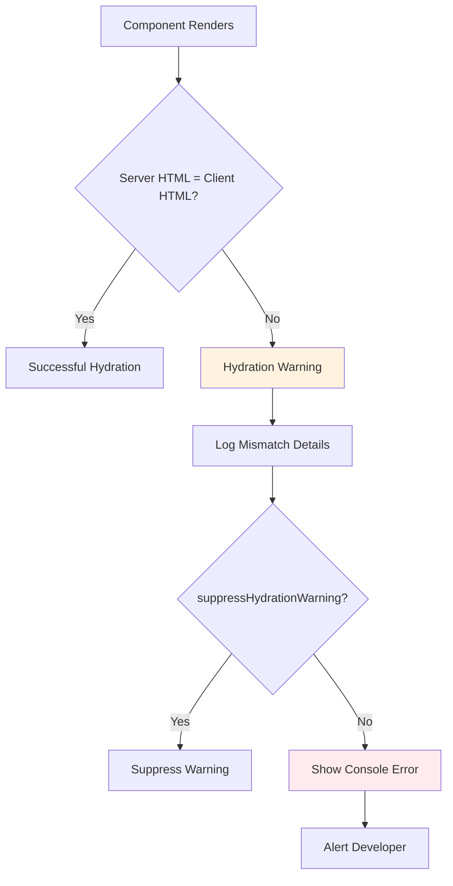
```mermaid
graph TD
    A[Component Renders] --> B{Server HTML = Client HTML?}
    B -->|Yes| C[Successful Hydration]
    B -->|No| D[Hydration Warning]
    D --> E[Log Mismatch Details]
    E --> F{suppressHydrationWarning?}
    F -->|Yes| G[Suppress Warning]
    F -->|No| H[Show Console Error]
    H --> I[Alert Developer]
    
    style D fill:#fff3e0
    style H fill:#ffebee
```

**Async Timeout Detection:**

```
Async Request Monitoring:
  1. Start timer when fetch begins
  2. Set maximum timeout (30 seconds)
  3. If timeout reached:
     - Cancel request (if supported)
     - Log timeout event
     - Show timeout error to user
     - Offer retry option
  4. Clear timer on success/error
```

**localStorage Corruption Handling:**

```
localStorage Safety Pattern:
  1. Try to read and parse data
  2. Catch SyntaxError or TypeError
  3. Log corruption details
  4. Clear corrupted key
  5. Return default/empty value
  6. Notify user of data reset (if significant)
```

#### 9.1.3 Prop Type Mismatch Prevention

**Runtime Validation Strategy:**

| Component Type | Validation Approach | When to Validate |
|----------------|---------------------|------------------|
| API Response Handlers | Zod schema validation | Before state update |
| Component Props | TypeScript + PropTypes | Development mode |
| Context Values | Type guards | Before context consumption |
| localStorage Data | JSON schema validation | On read |
| User Input | Input validation library | On submit |

**Example Validation Log:**

```
[ERROR] [Component:RecipeCard] Invalid prop type
  → Component: RecipeCard
  → Prop: prepTime
  → Expected: number
  → Received: "15" (string)
  → Source: API response
  → Action: Coerced to number, logged warning
```

### 9.2 Debugging Strategy Effectiveness

#### 9.2.1 How Strategy Addresses Silent Failures

| Silent Failure | Strategy Component | How It Helps |
|----------------|-------------------|---------------|
| Mismatched Props | TypeScript strict mode + logging | Compile-time and runtime type checking |
| Failed Hydration | Hydration error logging | Immediate detection in console |
| Async Never Resolving | Timeout implementation + logging | Automatic timeout after 30s |
| localStorage Errors | Try-catch + error logging | Graceful degradation, data reset |
| Missing Error Boundary | Global error boundary | Prevents white screen |
| Suppressed Errors | External error service (Sentry) | All errors captured in production |
| Race Conditions | Request ID tracking + logging | Trace concurrent requests |
| Memory Leaks | Performance monitoring | Detect gradual slowdown |
| CORS Issues | Network error type logging | Specific CORS error messages |
| Infinite Loops | Performance profiling alerts | High CPU usage detection |
| Stale Closures | Debug logging in callbacks | Log captured values |
| Failed Lazy Loading | Dynamic import error boundary | Fallback UI for failed chunks |

#### 9.2.2 Proactive Monitoring Checklist

**Development Checklist:**
- [ ] All API calls have timeout configured
- [ ] All async operations have error handling
- [ ] All localStorage operations wrapped in try-catch
- [ ] All major components wrapped in error boundaries
- [ ] All user inputs validated before submission
- [ ] All external resources have fallbacks
- [ ] All event listeners cleaned up in useEffect
- [ ] All dynamic imports have loading/error states

**Production Monitoring:**
- [ ] Error tracking service integrated (Sentry)
- [ ] Performance monitoring enabled
- [ ] Error rate alerts configured
- [ ] Log aggregation setup
- [ ] User session replay available (optional)
- [ ] Uptime monitoring active
- [ ] API response time tracking
- [ ] Error notification webhooks configured

---

## 10. Debug Utility Library Specification

### 10.1 Debug Logger Module Design

#### 10.1.1 Module Interface (Conceptual)

**Core Functions:**

```
Debug Logger Interface:

Functions:
  - debug(context, message, data?): void
  - info(context, message, data?): void
  - warn(context, message, data?): void
  - error(context, message, data?, error?): void
  - success(context, message, data?): void
  - group(context, label): void
  - groupEnd(): void
  - time(label): void
  - timeEnd(label): void
  - table(data): void

Configuration:
  - setLogLevel(level: LogLevel): void
  - setEnabled(enabled: boolean): void
  - addTransport(transport: LogTransport): void
```

#### 10.1.2 Color Scheme Definition

**Console Styling:**

| Log Level | Color Code | Background | Font Weight | Icon |
|-----------|-----------|------------|-------------|------|
| DEBUG | `#9E9E9E` | None | Normal | 🔍 |
| INFO | `#2196F3` | None | Normal | ℹ️ |
| WARN | `#FF9800` | None | Bold | ⚠️ |
| ERROR | `#F44336` | `#FFEBEE` | Bold | ❌ |
| SUCCESS | `#4CAF50` | None | Normal | ✅ |

#### 10.1.3 Log Output Format

**Standard Format:**

```
[LEVEL] [HH:MM:SS.mmm] [Context] Message
  → key1: value1
  → key2: value2
  → key3: { nested object }
```

**Example Outputs:**

```
[INFO] [10:30:45.123] [API:RecipeSearch] Request received
  → ingredients: ["tomato", "pasta"]
  → filters: { cuisine: "Italian" }

[DEBUG] [10:30:45.156] [API:RecipeSearch] Processing search
  → recipesLoaded: 150
  → matchesFound: 45

[SUCCESS] [10:30:45.201] [API:RecipeSearch] Response sent
  → resultCount: 12
  → duration: 78ms

[ERROR] [10:30:45.234] [API:RecipeDetail] Recipe not found
  → requestedId: "abc123"
  → normalizedId: "abc123"
  → datasetSize: 150
```

#### 10.1.4 Environment-Based Behavior

**Development Environment:**
```
Behavior:
  - All log levels enabled
  - Colored console output
  - Full stack traces
  - Object expansion enabled
  - Performance timing shown
  - Source maps used
```

**Production Environment:**
```
Behavior:
  - ERROR and WARN only
  - Plain text output (no colors)
  - Sanitized error messages
  - Objects collapsed
  - Logs sent to external service
  - Sensitive data filtered
```

#### 10.1.5 Usage Examples (Conceptual)

**Basic Logging:**

```
Usage Pattern:
  Import logger at top of file
  
  In function:
    logger.info('API:RecipeSearch', 'Request received', { 
      ingredients, 
      filters 
    })
    
    try {
      // ... process request
      logger.success('API:RecipeSearch', 'Response sent', { 
        resultCount 
      })
    } catch (error) {
      logger.error('API:RecipeSearch', 'Request failed', { 
        ingredients, 
        filters 
      }, error)
    }
```

**Grouped Logging:**

```
Usage Pattern:
  logger.group('API:RecipeSearch', 'Processing search request')
  logger.debug('API:RecipeSearch', 'Loading recipes')
  logger.debug('API:RecipeSearch', 'Matching ingredients')
  logger.debug('API:RecipeSearch', 'Applying filters')
  logger.groupEnd()
```

**Performance Timing:**

```
Usage Pattern:
  logger.time('recipe-search')
  // ... perform search
  logger.timeEnd('recipe-search')
  
  Output: recipe-search: 78.45ms
```

### 10.2 Function Entry/Exit Logging

#### 10.2.1 Function Lifecycle Logging Pattern

```
Pattern:
  function searchRecipes(params) {
    logger.debug('RecipeSearch', 'Function entry', { params })
    
    try {
      const result = // ... process
      logger.debug('RecipeSearch', 'Function exit', { result })
      return result
    } catch (error) {
      logger.error('RecipeSearch', 'Function error', { params }, error)
      throw error
    }
  }
```

#### 10.2.2 Automatic Function Wrapping (Advanced)

**Decorator Pattern (Conceptual):**

```
Concept:
  Wrap critical functions with automatic logging
  
  Wrapped function behavior:
    1. Log entry with parameters
    2. Start performance timer
    3. Execute original function
    4. Log exit with result
    5. Log duration
    6. If error: log error and re-throw
```

### 10.3 Custom Tag System

#### 10.3.1 Tag Categories

| Tag Category | Purpose | Examples |
|--------------|---------|----------|
| Module | Identify source module | `API:`, `Component:`, `Lib:` |
| Feature | Identify feature area | `Search`, `RecipeDetail`, `Favorites` |
| Severity | Indicate importance | `CRITICAL:`, `PERF:`, `SECURITY:` |
| User Impact | Show user effect | `UI:`, `DATA:`, `UX:` |

#### 10.3.2 Tag Filtering

**Filter Logs by Tag:**

```
Filter Examples:
  
  Show only API logs:
    localStorage.setItem('debug-filter', 'API:')
  
  Show only errors:
    localStorage.setItem('debug-level', 'ERROR')
  
  Show specific feature:
    localStorage.setItem('debug-filter', 'Search')
```

#### 5.1.1 Root Layout Error Boundary
Wrap the entire application in a top-level error boundary at `app/layout.tsx`.

**Integration Point:**
- Wrap the children prop with ErrorBoundary component
- Provide custom fallback UI for application-level errors
- Log all caught errors with full context

**Error Boundary Behavior:**
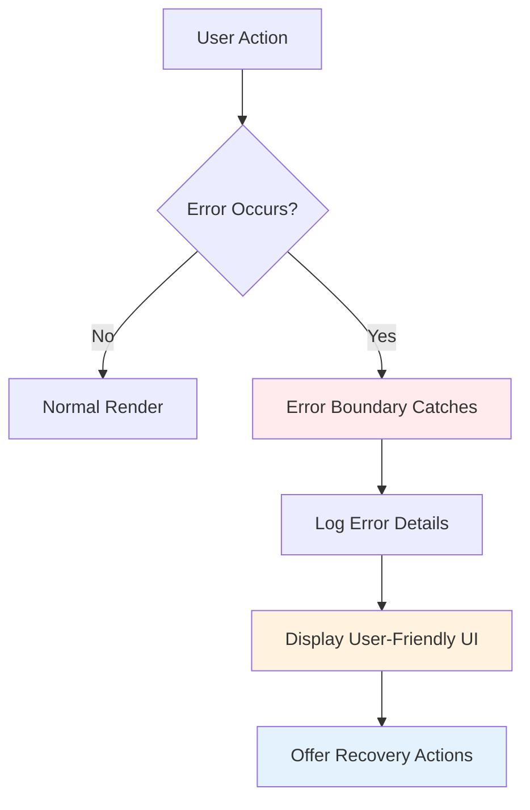
```mermaid
graph TD
    A[User Action] --> B{Error Occurs?}
    B -->|No| C[Normal Render]
    B -->|Yes| D[Error Boundary Catches]
    D --> E[Log Error Details]
    E --> F[Display User-Friendly UI]
    F --> G[Offer Recovery Actions]
    
    style D fill:#ffebee
    style F fill:#fff3e0
    style G fill:#e3f2fd
```

**Recovery Actions Provided:**
- Reload page button
- Navigate to home/dashboard
- Report error (future enhancement)
- View error details (development only)

#### 5.1.2 Page-Level Error Boundaries
Implement error boundaries for each major page:
- Search page (`app/search/page.tsx`)
- Recipe detail page (`app/recipes/[id]/page.tsx`)
- Favorites page (`app/favorites/page.tsx`)
- Dashboard page (`app/dashboard/page.tsx`)
- Meal planner page (`app/planner/page.tsx`)

**Page-Specific Error Context:**
Each page should provide contextual error messages:
- Search page: "Unable to load search interface"
- Recipe detail: "Unable to load recipe details for ID: [id]"
- Favorites: "Unable to load your saved recipes"

### 5.2 Component-Level Error Handling

#### 5.2.1 Data Fetching Error Pattern
All components that fetch data must implement try-catch with error state.

**Error State Management Pattern:**

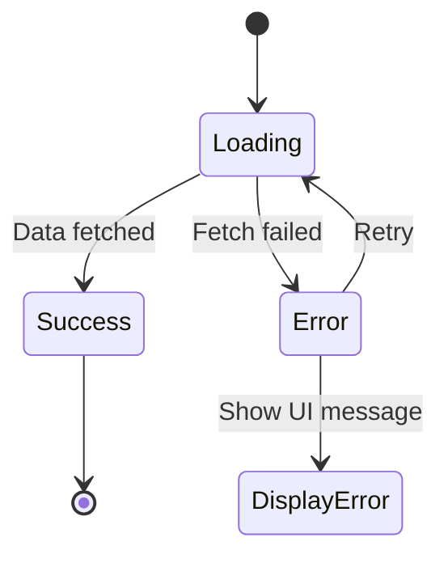
```mermaid
stateDiagram-v2
    [*] --> Loading
    Loading --> Success: Data fetched
    Loading --> Error: Fetch failed
    Error --> Loading: Retry
    Success --> [*]
    
    Error --> DisplayError: Show UI message
```

**Error State Structure:**
- `loading`: boolean (true while fetching)
- `error`: string | null (error message)
- `data`: T | null (fetched data)

#### 5.2.2 Error UI Component Design
Create a reusable error display component at `components/common/ErrorMessage.tsx`.

**Component Characteristics:**
- Accepts error message and optional recovery action
- Displays friendly, non-technical message to users
- Provides visual hierarchy (icon, title, message, action)
- Supports different error types (network, not found, validation, etc.)

**Error Message Variants:**

| Variant | Icon | Title | Use Case |
|---------|------|-------|----------|
| Network | 🌐 | Connection Error | Failed API calls |
| NotFound | 🔍 | Not Found | Missing resources |
| Validation | ⚠️ | Invalid Input | Form/parameter errors |
| Server | 🔧 | Server Error | 500-level responses |
| Generic | ⚠️ | Something Went Wrong | Unknown errors |

### 5.3 Recipe Detail Page Error Handling

#### 5.3.1 Specific Error Scenarios
Handle the following error cases explicitly:

**Recipe Not Found (404):**
- Display: "Recipe not found"
- Log: Requested ID, search method used
- Action: "Browse other recipes" button to /search

**Network Error:**
- Display: "Unable to load recipe. Please check your connection."
- Log: Fetch error details, URL attempted
- Action: "Retry" button

**Invalid ID Format:**
- Display: "Invalid recipe link"
- Log: Malformed ID value
- Action: "Go to search" button

#### 5.3.2 Enhanced Recipe Detail Logging
**Client-Side Logging Points:**
1. Log when recipe detail page loads with ID parameter
2. Log fetch attempt to API endpoint
3. Log API response status and data presence
4. Log if recipe is not found in local data
5. Log rendering completion or error

### 5.4 Search Page Error Handling

#### 5.4.1 Search-Specific Errors
**Empty Results (Not an Error):**
- Display: "No recipes match your search"
- Provide suggestions to broaden search
- Do not log as error

**API Failure:**
- Display: "Search is temporarily unavailable"
- Log: API endpoint, request payload, error response
- Action: "Try again" button

**Invalid Input:**
- Display: Inline validation messages
- Log: Validation failure details
- Action: Clear invalid input guidance

#### 5.4.2 Network Request Logging
All fetch calls in search page must log:
1. Request initiation (endpoint, method, payload)
2. Response receipt (status, data summary)
3. Any errors with full context
4. Retry attempts (if implemented)

### 5.5 Favorites Page Error Handling

#### 5.5.1 localStorage Errors
**Quota Exceeded:**
- Display: "Unable to save favorites (storage full)"
- Log: Storage operation attempted, current usage
- Action: Suggest clearing old data

**Parse Errors:**
- Display: "Unable to load saved favorites"
- Log: Raw stored value, parse error
- Action: "Reset favorites" option

**No Favorites State:**
- Display: Empty state UI (not an error)
- Provide "Browse recipes" call to action

---

## 6. Debugging Output Visualization

### 6.1 Console Log Formatting

#### 6.1.1 Color Coding Strategy
Use console styling for visual log differentiation in browser console:

**Color Palette:**
- **DEBUG**: `color: #9E9E9E` (Gray)
- **INFO**: `color: #2196F3` (Blue)
- **WARN**: `color: #FF9800; font-weight: bold` (Orange)
- **ERROR**: `color: #F44336; font-weight: bold` (Red)
- **SUCCESS**: `color: #4CAF50` (Green)

#### 6.1.2 Log Format Template
```
[LEVEL] [TIMESTAMP] [CONTEXT] Message
  → Data: { structured object }
```

**Example Output:**
```
[INFO] [10:30:45.123] [API:RecipeSearch] Request received
  → Data: { ingredients: ["tomato", "pasta"], filters: {...} }

[DEBUG] [10:30:45.156] [API:RecipeSearch] Recipes loaded
  → Data: { count: 150, source: "recipes.json" }

[SUCCESS] [10:30:45.201] [API:RecipeSearch] Response sent
  → Data: { status: 200, resultCount: 12, duration: "78ms" }
```

#### 6.1.3 Structured Object Logging
For complex objects, use collapsible console groups:
- Use `console.group()` for major operations
- Use `console.groupCollapsed()` for detailed debug info
- Use `console.table()` for array data visualization

### 6.2 Network Tab Diagnostics

#### 6.2.1 API Request Headers
Include custom debug headers in development:
- `X-Debug-Timestamp`: Request timestamp
- `X-Debug-Context`: Component/page that initiated request
- `X-Request-ID`: Unique request identifier for tracing

#### 6.2.2 Response Metadata
Include debug information in API responses (development only):
```
{
  "data": { ... },
  "meta": {
    "timestamp": "2025-01-15T10:30:45.123Z",
    "processingTime": "78ms",
    "dataSource": "recipes.json",
    "resultCount": 12
  }
}
```

---

## 7. Error Recovery Mechanisms

### 7.1 Retry Logic Design

#### 7.1.1 Network Request Retry Pattern
Implement exponential backoff for failed network requests.

**Retry Configuration:**
- Maximum retry attempts: 3
- Base delay: 1000ms
- Backoff multiplier: 2 (exponential)
- Retry on: Network errors, 5xx status codes
- No retry on: 4xx client errors (except 408, 429)

**Retry Flow:**
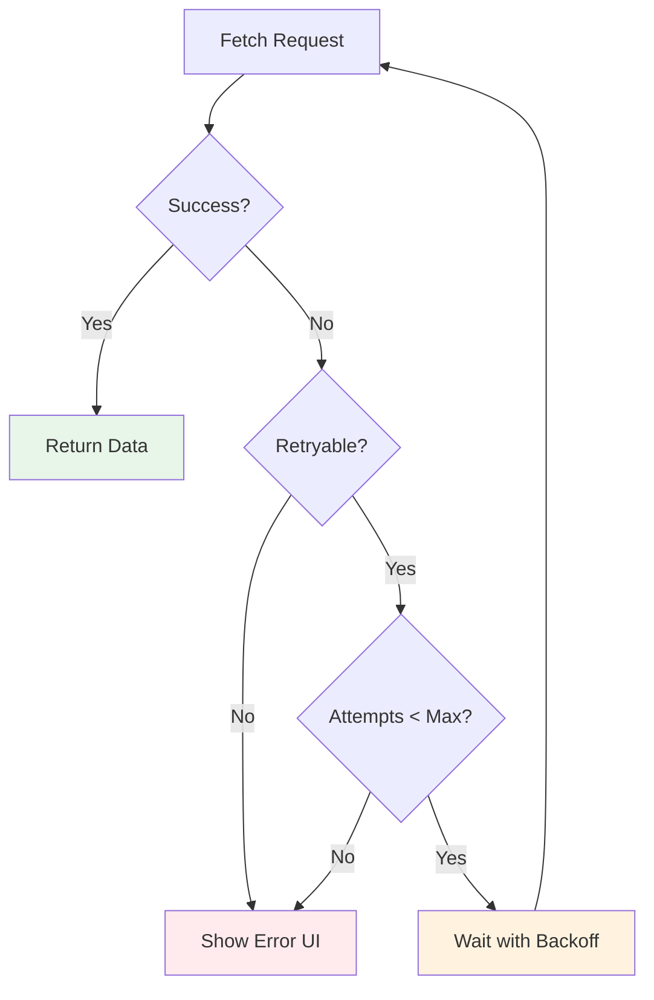
```mermaid
graph TD
    A[Fetch Request] --> B{Success?}
    B -->|Yes| C[Return Data]
    B -->|No| D{Retryable?}
    D -->|No| E[Show Error UI]
    D -->|Yes| F{Attempts < Max?}
    F -->|No| E
    F -->|Yes| G[Wait with Backoff]
    G --> A
    
    style C fill:#e8f5e9
    style E fill:#ffebee
    style G fill:#fff3e0
```

#### 7.1.2 Graceful Degradation
**Strategy for Component Failures:**
1. **Recipe Not Found**: Show empty state with search suggestions
2. **API Unavailable**: Fall back to cached data (if available)
3. **Image Load Failure**: Show placeholder image
4. **Video Embed Failure**: Show text-only instructions

### 7.2 User Feedback Mechanisms

#### 7.2.1 Loading States
Provide clear loading indicators during async operations:
- Skeleton screens for initial page loads
- Spinner for quick operations (<2s expected)
- Progress bars for longer operations (>2s expected)
- Inline loading states for component-level fetches

#### 7.2.2 Error Toast Notifications
For non-critical errors, use toast notifications (future enhancement):
- Network reconnection messages
- Auto-save failures
- Background sync errors

---

## 11. Testing and Validation Strategy

### 11.1 API Route Testing Utility

#### 11.1.1 Comprehensive Test Script Design

**Test Script Location:** `scripts/testApiRoutes.js`

**Script Capabilities:**
- Automated testing of all API endpoints
- Valid and invalid input testing
- Response schema validation
- Performance benchmarking
- Error response verification
- Test result reporting with pass/fail summary

**Test Suite Structure:**

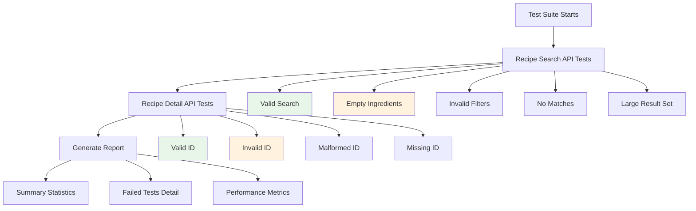
```mermaid
graph TD
    A[Test Suite Starts] --> B[Recipe Search API Tests]
    B --> C[Recipe Detail API Tests]
    C --> D[Generate Report]
    
    B --> E[Valid Search]
    B --> F[Empty Ingredients]
    B --> G[Invalid Filters]
    B --> H[No Matches]
    B --> I[Large Result Set]
    
    C --> J[Valid ID]
    C --> K[Invalid ID]
    C --> L[Malformed ID]
    C --> M[Missing ID]
    
    D --> N[Summary Statistics]
    D --> O[Failed Tests Detail]
    D --> P[Performance Metrics]
    
    style E fill:#e8f5e9
    style J fill:#e8f5e9
    style F fill:#fff3e0
    style K fill:#fff3e0
```

#### 11.1.2 Recipe Search API Test Cases

| Test ID | Description | Input | Expected Status | Expected Response | Validation |
|---------|-------------|-------|-----------------|-------------------|------------|
| RS-001 | Valid search with common ingredients | `["tomato", "pasta"]` | 200 | Array of recipes | `recipes.length > 0` |
| RS-002 | Empty ingredients array | `[]` | 400 | Error message | `error` field present |
| RS-003 | Single ingredient | `["chicken"]` | 200 | Array of recipes | `recipes.length >= 0` |
| RS-004 | Special characters | `["tom@to", "p@sta"]` | 200 | Array (possibly empty) | Valid response structure |
| RS-005 | Very long ingredient list | 50 ingredients | 200 | Array of recipes | Response time < 2s |
| RS-006 | Invalid cuisine filter | `{cuisine: "InvalidCuisine"}` | 200 | Empty array | `totalMatches: 0` |
| RS-007 | Multiple dietary filters | `{dietaryFilters: ["vegan", "gluten-free"]}` | 200 | Filtered recipes | All recipes match filters |
| RS-008 | Impossible combination | `["xyz123impossible"]` | 200 | Empty array | `totalMatches: 0` |
| RS-009 | Missing request body | `null` | 400 | Error message | Validation error |
| RS-010 | Malformed JSON | Invalid JSON | 400 | Parse error | Error response |

#### 11.1.3 Recipe Detail API Test Cases

| Test ID | Description | Input ID | Expected Status | Expected Response | Validation |
|---------|-------------|----------|-----------------|-------------------|------------|
| RD-001 | Valid existing ID | First recipe from dataset | 200 | Recipe object | `recipe.id` matches |
| RD-002 | Non-existent ID | `"nonexistent123"` | 404 | Error message | `code: "RECIPE_NOT_FOUND"` |
| RD-003 | Malformed ID | `"abc"` | 404 | Error message | Error field present |
| RD-004 | ID with special chars | `"recipe@123"` | 404 | Error message | Handled gracefully |
| RD-005 | Empty string ID | `""` | 404 | Error message | Validation error |
| RD-006 | Numeric ID | `123` | 200 or 404 | Recipe or error | Valid response |
| RD-007 | ID with whitespace | `" recipe-001 "` | 200 or 404 | Recipe (if normalized) | ID normalization works |
| RD-008 | Case variation | `"Recipe-001"` | 200 or 404 | Recipe (if case-insensitive) | Case handling |
| RD-009 | Last recipe in dataset | Last recipe ID | 200 | Recipe object | Boundary test |
| RD-010 | Very long ID string | 1000 character string | 404 | Error message | No crash |

#### 11.1.4 Test Execution Flow

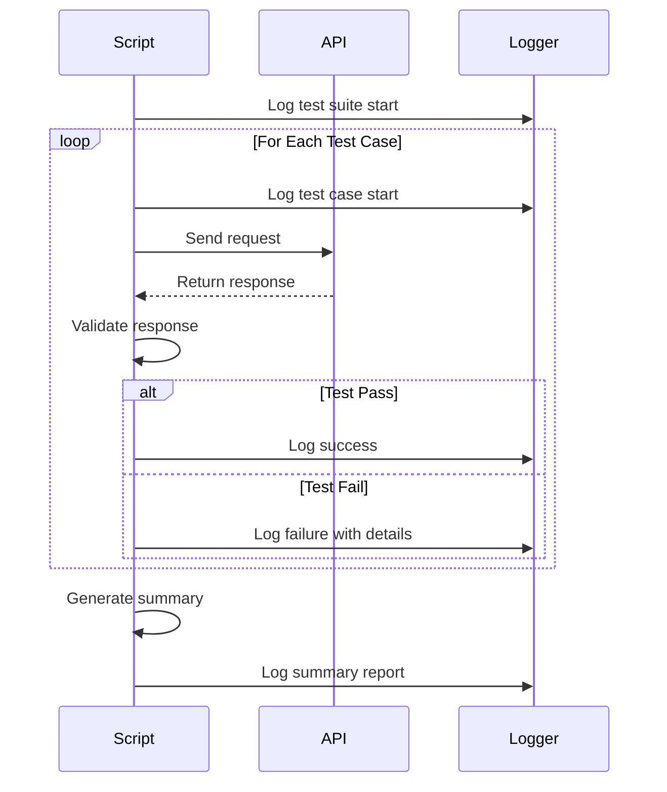
```mermaid
sequenceDiagram
    participant Script
    participant API
    participant Logger
    
    Script->>Logger: Log test suite start
    
    loop For Each Test Case
        Script->>Logger: Log test case start
        Script->>API: Send request
        API-->>Script: Return response
        Script->>Script: Validate response
        
        alt Test Pass
            Script->>Logger: Log success
        else Test Fail
            Script->>Logger: Log failure with details
        end
    end
    
    Script->>Script: Generate summary
    Script->>Logger: Log summary report
```

#### 11.1.5 Test Report Format

**Console Output Example:**

```
========================================
API Route Test Suite
========================================

Recipe Search API Tests:
  ✅ RS-001: Valid search with common ingredients (78ms)
  ✅ RS-002: Empty ingredients array (12ms)
  ✅ RS-003: Single ingredient (45ms)
  ✅ RS-004: Special characters (52ms)
  ⚠️  RS-005: Very long ingredient list (2,345ms - SLOW)
  ✅ RS-006: Invalid cuisine filter (34ms)
  ✅ RS-007: Multiple dietary filters (67ms)
  ✅ RS-008: Impossible combination (29ms)
  ✅ RS-009: Missing request body (8ms)
  ✅ RS-010: Malformed JSON (10ms)

Recipe Detail API Tests:
  ✅ RD-001: Valid existing ID (23ms)
  ✅ RD-002: Non-existent ID (15ms)
  ✅ RD-003: Malformed ID (12ms)
  ✅ RD-004: ID with special chars (18ms)
  ✅ RD-005: Empty string ID (10ms)
  ✅ RD-006: Numeric ID (20ms)
  ✅ RD-007: ID with whitespace (22ms)
  ❌ RD-008: Case variation - FAILED
      Expected: 200
      Received: 404
      Details: Case-sensitive comparison detected
  ✅ RD-009: Last recipe in dataset (25ms)
  ✅ RD-010: Very long ID string (14ms)

========================================
Test Summary:
========================================
Total Tests: 20
Passed: 18 (90%)
Failed: 1 (5%)
Warnings: 1 (5%)

Average Response Time: 68ms
Slowest Test: RS-005 (2,345ms)
Fastest Test: RS-009 (8ms)

========================================
```

#### 11.1.6 NPM Script Integration

**package.json Scripts:**

```
NPM Scripts:
  "test:api": "node scripts/testApiRoutes.js"
  "test:api:watch": "nodemon scripts/testApiRoutes.js"
  "test:api:verbose": "DEBUG=* node scripts/testApiRoutes.js"
  "test:api:report": "node scripts/testApiRoutes.js > test-results.txt"
```

### 11.2 REST Client Test Collections

#### 11.2.1 VS Code REST Client Format

**File Location:** `tests/api-tests.http`

**Test Collection Structure:**

```
HTTP Request Format:

### Recipe Search - Valid Request
POST http://localhost:3000/api/recipes/search
Content-Type: application/json

{
  "ingredients": ["tomato", "pasta"],
  "filters": {
    "cuisine": "Italian",
    "dietaryFilters": ["vegetarian"]
  }
}

### Recipe Search - Empty Ingredients (Should Fail)
POST http://localhost:3000/api/recipes/search
Content-Type: application/json

{
  "ingredients": []
}

### Recipe Detail - Valid ID
GET http://localhost:3000/api/recipes/recipe-001

### Recipe Detail - Invalid ID (Should 404)
GET http://localhost:3000/api/recipes/nonexistent123
```

#### 11.2.2 Postman Collection Structure

**Collection Organization:**

```
SmartMeal API Tests/
  ├─ Recipe Search/
  │   ├─ Valid Search
  │   ├─ Empty Ingredients
  │   ├─ Multiple Filters
  │   └─ No Results
  ├─ Recipe Detail/
  │   ├─ Valid ID
  │   ├─ Invalid ID
  │   └─ Malformed ID
  └─ Environment Variables
```

**Test Scripts (Postman):**

```
Postman Test Example:

Test Name: "Valid Recipe Search"
Request: POST {{baseUrl}}/api/recipes/search

Pre-request Script:
  // Set timestamp
  pm.environment.set("requestTime", Date.now())

Tests:
  // Validate status code
  pm.test("Status code is 200", () => {
    pm.response.to.have.status(200)
  })
  
  // Validate response structure
  pm.test("Response has recipes array", () => {
    const json = pm.response.json()
    pm.expect(json).to.have.property('recipes')
    pm.expect(json.recipes).to.be.an('array')
  })
  
  // Performance check
  pm.test("Response time under 1000ms", () => {
    pm.expect(pm.response.responseTime).to.be.below(1000)
  })
```

### 11.3 Cypress End-to-End Test Scenarios

#### 11.3.1 Error Scenario Testing

**Test File:** `cypress/e2e/error-handling.cy.ts`

**Test Scenarios:**

| Scenario | Steps | Expected Outcome |
|----------|-------|------------------|
| Recipe Not Found | Navigate to `/recipes/nonexistent123` | "Recipe Not Found" message displayed |
| Network Error | Stub API to fail, attempt search | Network error message shown |
| Search No Results | Search for impossible ingredient | "No recipes found" message |
| Failed Image Load | Stub image to 404 | Placeholder image shown |
| API Timeout | Stub slow API (>30s) | Timeout error displayed |

**Test Structure (Conceptual):**

```
Cypress Test Pattern:

describe('Error Handling', () => {
  it('shows error when recipe not found', () => {
    Steps:
      1. Visit /recipes/nonexistent123
      2. Wait for page load
      3. Assert error message visible
      4. Assert "Search Recipes" button visible
      5. Click button and verify navigation
  })
  
  it('handles network errors gracefully', () => {
    Steps:
      1. Intercept API call to fail
      2. Visit search page
      3. Enter ingredients and submit
      4. Assert network error message shown
      5. Assert retry button visible
  })
})
```

---

## 12. Live Debug Mode Implementation

### 12.1 Environment Variable Configuration

#### 12.1.1 Debug Environment Variables

**Environment Variable Schema:**

| Variable | Type | Default | Description |
|----------|------|---------|-------------|
| `NEXT_PUBLIC_DEBUG_MODE` | boolean | `false` | Enable verbose debugging globally |
| `NEXT_PUBLIC_LOG_LEVEL` | string | `"INFO"` | Minimum log level: DEBUG, INFO, WARN, ERROR |
| `NEXT_PUBLIC_LOG_API` | boolean | `true` (dev) | Log all API requests/responses |
| `NEXT_PUBLIC_LOG_COMPONENTS` | boolean | `false` | Log component lifecycle events |
| `NEXT_PUBLIC_LOG_NETWORK` | boolean | `true` (dev) | Log network requests |
| `NEXT_PUBLIC_ENABLE_ERROR_DETAILS` | boolean | `true` (dev) | Show error stack traces in UI |
| `DEBUG_FILTER` | string | `"*"` | Filter logs by context pattern |

#### 12.1.2 Runtime Debug Toggle

**localStorage Toggle Mechanism:**

```
Debug Mode Activation:

Method 1: Environment Variable (Persistent)
  .env.local file:
    NEXT_PUBLIC_DEBUG_MODE=true
    NEXT_PUBLIC_LOG_LEVEL=DEBUG

Method 2: localStorage (Session)
  Browser console:
    localStorage.setItem('smartmeal_debug', 'true')
    localStorage.setItem('smartmeal_log_level', 'DEBUG')
    location.reload()

Method 3: Query Parameter (Temporary)
  URL:
    http://localhost:3000/recipes/123?debug=true
```

#### 12.1.3 Debug Mode Initialization

**Initialization Flow:**

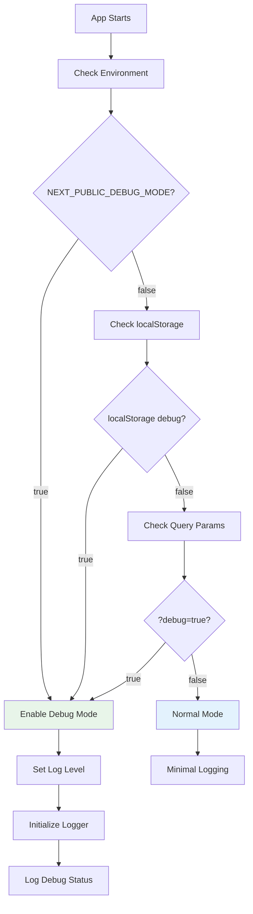
```mermaid
graph TD
    A[App Starts] --> B[Check Environment]
    B --> C{NEXT_PUBLIC_DEBUG_MODE?}
    C -->|true| D[Enable Debug Mode]
    C -->|false| E[Check localStorage]
    E --> F{localStorage debug?}
    F -->|true| D
    F -->|false| G[Check Query Params]
    G --> H{?debug=true?}
    H -->|true| D
    H -->|false| I[Normal Mode]
    
    D --> J[Set Log Level]
    J --> K[Initialize Logger]
    K --> L[Log Debug Status]
    
    I --> M[Minimal Logging]
    
    style D fill:#e8f5e9
    style I fill:#e3f2fd
```

### 12.2 Conditional Logging Implementation

#### 12.2.1 Log Level Filtering

**Filtering Logic:**

```
Log Level Hierarchy:
  DEBUG (0) < INFO (1) < WARN (2) < ERROR (3)

Filtering Rule:
  if (logLevel >= configuredMinLevel) {
    output log
  } else {
    suppress log
  }

Example:
  Configured level: INFO (1)
  
  debug() call: Level 0 < 1 → Suppressed
  info() call: Level 1 >= 1 → Shown
  warn() call: Level 2 >= 1 → Shown
  error() call: Level 3 >= 1 → Shown
```

#### 12.2.2 Context-Based Filtering

**Filter Patterns:**

```
Filter Examples:

Show all logs:
  DEBUG_FILTER="*"

Show only API logs:
  DEBUG_FILTER="API:*"

Show specific feature:
  DEBUG_FILTER="*RecipeSearch*"

Show multiple contexts:
  DEBUG_FILTER="API:*,Component:Recipe*"

Exclude specific contexts:
  DEBUG_FILTER="*,-Component:Button"
```

**Matching Algorithm:**

```
Pattern Matching:
  1. Parse filter pattern
  2. Split by comma for multiple patterns
  3. For each log:
     a. Check if context matches any include pattern
     b. Check if context matches any exclude pattern
     c. Include if matches and not excluded
  4. Output or suppress based on match
```

### 12.3 Debug Panel UI (Optional Enhancement)

#### 12.3.1 Floating Debug Panel Design

**Panel Features:**
- Toggle visibility with keyboard shortcut (Ctrl+Shift+D)
- Real-time log stream
- Log level filtering
- Context filtering
- Clear logs button
- Export logs to file
- Performance metrics display

**Panel Layout:**

```
Debug Panel UI:
┌────────────────────────────────────────┐
│ 🔧 Debug Panel          [Minimize] [Close] │
├────────────────────────────────────────┤
│ Filters:                                 │
│ Level: [All] [DEBUG] [INFO] [WARN] [ERROR]│
│ Context: [_________________] [Filter]    │
│ [Clear Logs] [Export] [Pause]            │
├────────────────────────────────────────┤
│ Logs:                                    │
│ [INFO] Recipe search started            │
│ [DEBUG] 150 recipes loaded               │
│ [SUCCESS] 12 matches found               │
│ ...                                      │
│                                          │
├────────────────────────────────────────┤
│ Stats:                                   │
│ Total Logs: 127                          │
│ Errors: 3 | Warnings: 8                   │
│ Avg API Time: 78ms                       │
└────────────────────────────────────────┘
```

### 12.4 Debug Mode Performance Impact

#### 12.4.1 Performance Considerations

| Operation | Normal Mode | Debug Mode | Impact |
|-----------|-------------|------------|--------|
| API Request | ~50ms | ~52ms | +4% (logging overhead) |
| Component Render | ~10ms | ~12ms | +20% (lifecycle logging) |
| Console Output | Minimal | Verbose | Negligible |
| Memory Usage | Baseline | +2-5MB | Log buffer storage |
| Bundle Size | Baseline | +15KB | Debug utilities |

#### 12.4.2 Production Safety

**Safeguards:**

```
Production Checks:
  1. Always check environment before verbose logging
  2. Strip debug code in production build (tree-shaking)
  3. Only send ERROR level to external services
  4. Limit log buffer size (max 1000 entries)
  5. Auto-disable after inactivity
  6. Sanitize all logged data
```

---

## 13. Guided Debug Scenarios and Decision Trees

### 13.1 Common Bug Report Scenarios

#### 13.1.1 Scenario: Blank Page After Clicking Recipe

**Decision Tree:**

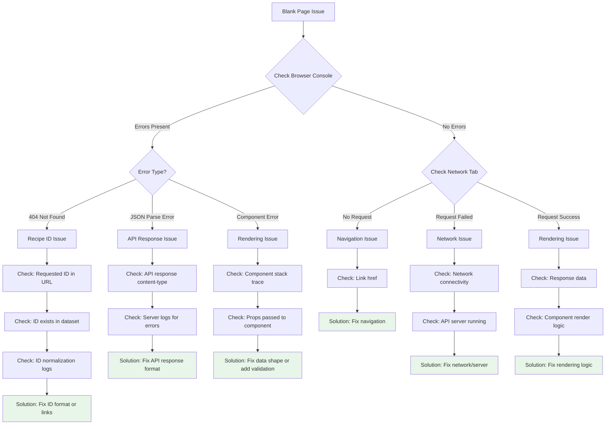
```mermaid
graph TD
    A[Blank Page Issue] --> B{Check Browser Console}
    B -->|Errors Present| C{Error Type?}
    B -->|No Errors| D{Check Network Tab}
    
    C -->|404 Not Found| E[Recipe ID Issue]
    C -->|JSON Parse Error| F[API Response Issue]
    C -->|Component Error| G[Rendering Issue]
    
    E --> E1[Check: Requested ID in URL]
    E1 --> E2[Check: ID exists in dataset]
    E2 --> E3[Check: ID normalization logs]
    E3 --> E4[Solution: Fix ID format or links]
    
    F --> F1[Check: API response content-type]
    F1 --> F2[Check: Server logs for errors]
    F2 --> F3[Solution: Fix API response format]
    
    G --> G1[Check: Component stack trace]
    G1 --> G2[Check: Props passed to component]
    G2 --> G3[Solution: Fix data shape or add validation]
    
    D -->|No Request| H[Navigation Issue]
    D -->|Request Failed| I[Network Issue]
    D -->|Request Success| J[Rendering Issue]
    
    H --> H1[Check: Link href]
    H1 --> H2[Solution: Fix navigation]
    
    I --> I1[Check: Network connectivity]
    I1 --> I2[Check: API server running]
    I2 --> I3[Solution: Fix network/server]
    
    J --> J1[Check: Response data]
    J1 --> J2[Check: Component render logic]
    J2 --> J3[Solution: Fix rendering logic]
    
    style E4 fill:#e8f5e9
    style F3 fill:#e8f5e9
    style G3 fill:#e8f5e9
    style H2 fill:#e8f5e9
    style I3 fill:#e8f5e9
    style J3 fill:#e8f5e9
```

**Step-by-Step Checklist:**

```
Step 1: Open Browser Console (F12)
  ✅ Are there any red error messages?
  ✅ What is the error message?
  ✅ What is the stack trace?

Step 2: Check Network Tab
  ✅ Is there a request to /api/recipes/[id]?
  ✅ What is the response status code?
  ✅ What is the response body?

Step 3: Verify Recipe ID
  ✅ What ID is in the URL?
  ✅ Does this ID exist in recipes.json?
  ✅ Is the ID format correct?

Step 4: Check Server Logs
  ✅ Is there an API log for this request?
  ✅ What does the ID validation log say?
  ✅ Was a recipe found?

Step 5: Verify Component Rendering
  ✅ Did the component receive data?
  ✅ Is the data shape correct?
  ✅ Are there any null/undefined accesses?
```

#### 13.1.2 Scenario: Search Returns No Results (Unexpected)

**Decision Tree:**

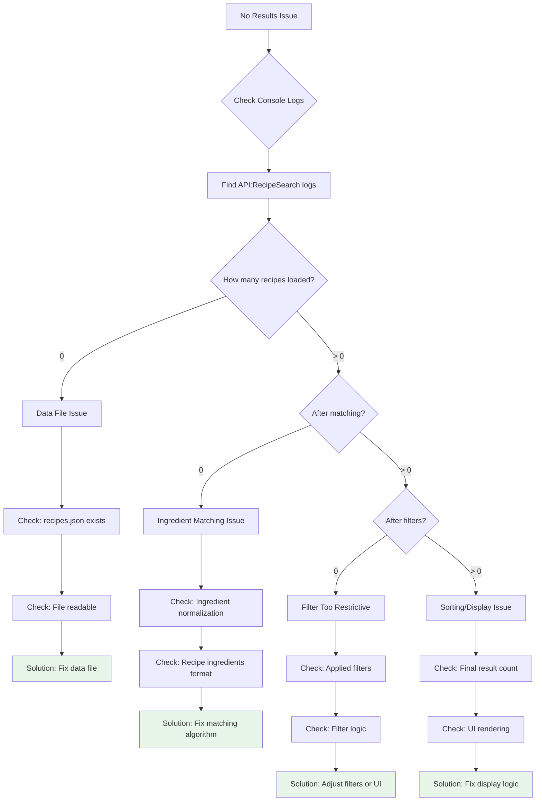
```mermaid
graph TD
    A[No Results Issue] --> B{Check Console Logs}
    B --> C[Find API:RecipeSearch logs]
    C --> D{How many recipes loaded?}
    
    D -->|0| E[Data File Issue]
    D -->|> 0| F{After matching?}
    
    E --> E1[Check: recipes.json exists]
    E1 --> E2[Check: File readable]
    E2 --> E3[Solution: Fix data file]
    
    F -->|0| G[Ingredient Matching Issue]
    F -->|> 0| H{After filters?}
    
    G --> G1[Check: Ingredient normalization]
    G1 --> G2[Check: Recipe ingredients format]
    G2 --> G3[Solution: Fix matching algorithm]
    
    H -->|0| I[Filter Too Restrictive]
    H -->|> 0| J[Sorting/Display Issue]
    
    I --> I1[Check: Applied filters]
    I1 --> I2[Check: Filter logic]
    I2 --> I3[Solution: Adjust filters or UI]
    
    J --> J1[Check: Final result count]
    J1 --> J2[Check: UI rendering]
    J2 --> J3[Solution: Fix display logic]
    
    style E3 fill:#e8f5e9
    style G3 fill:#e8f5e9
    style I3 fill:#e8f5e9
    style J3 fill:#e8f5e9
```

**Step-by-Step Checklist:**

```
Step 1: Check Search Request
  ✅ What ingredients were entered?
  ✅ What filters were applied?
  ✅ Check browser console for request log

Step 2: Check API Processing Logs
  ✅ How many recipes loaded from file?
  ✅ How many after ingredient matching?
  ✅ How many after filters applied?
  ✅ What is the final count?

Step 3: Verify Ingredient Matching
  ✅ Are ingredients normalized correctly?
  ✅ Do recipe ingredients match expected format?
  ✅ Is partial matching working?

Step 4: Check Filters
  ✅ Are filters too restrictive?
  ✅ Do any recipes match all filters?
  ✅ Try search without filters

Step 5: Verify UI Display
  ✅ Is result count > 0 in API response?
  ✅ Is UI showing "no results" incorrectly?
  ✅ Check component rendering logic
```

#### 13.1.3 Scenario: Favorites Not Saving

**Decision Tree:**

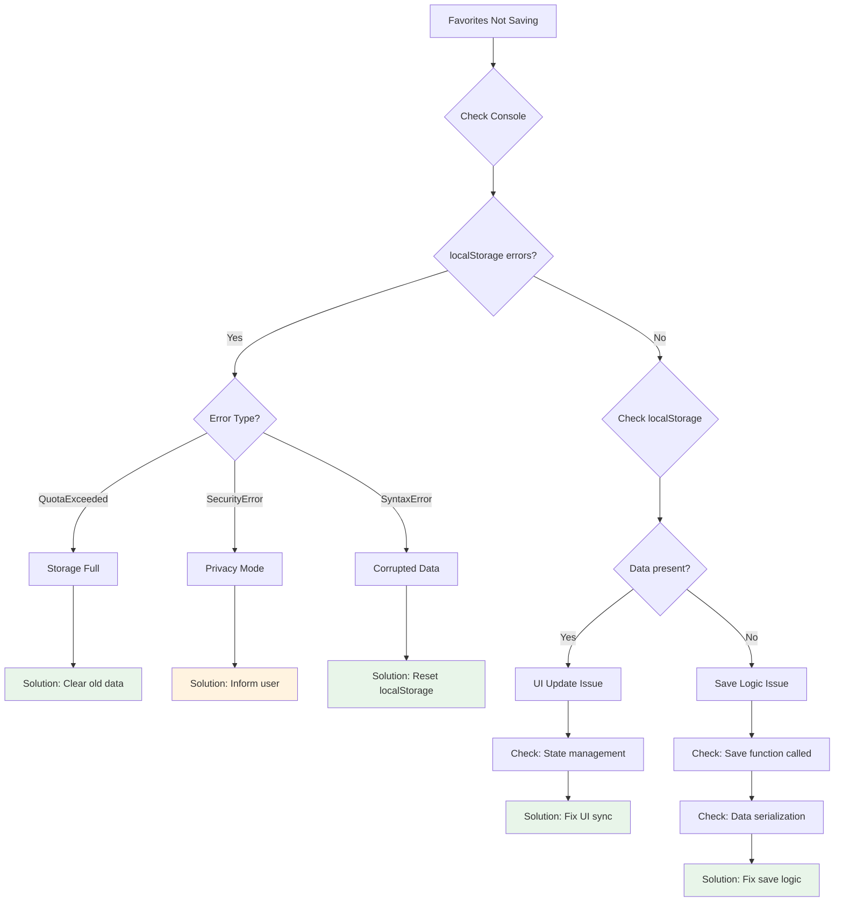
```mermaid
graph TD
    A[Favorites Not Saving] --> B{Check Console}
    B --> C{localStorage errors?}
    
    C -->|Yes| D{Error Type?}
    C -->|No| E{Check localStorage}
    
    D -->|QuotaExceeded| F[Storage Full]
    D -->|SecurityError| G[Privacy Mode]
    D -->|SyntaxError| H[Corrupted Data]
    
    F --> F1[Solution: Clear old data]
    G --> G1[Solution: Inform user]
    H --> H1[Solution: Reset localStorage]
    
    E --> I{Data present?}
    I -->|Yes| J[UI Update Issue]
    I -->|No| K[Save Logic Issue]
    
    J --> J1[Check: State management]
    J1 --> J2[Solution: Fix UI sync]
    
    K --> K1[Check: Save function called]
    K1 --> K2[Check: Data serialization]
    K2 --> K3[Solution: Fix save logic]
    
    style F1 fill:#e8f5e9
    style G1 fill:#fff3e0
    style H1 fill:#e8f5e9
    style J2 fill:#e8f5e9
    style K3 fill:#e8f5e9
```

**Step-by-Step Checklist:**

```
Step 1: Check Console for Errors
  ✅ Any localStorage errors?
  ✅ Any JSON parse/stringify errors?

Step 2: Inspect localStorage
  ✅ Open DevTools > Application > localStorage
  ✅ Check for 'smartmeal_favorites' key
  ✅ Verify data format

Step 3: Test Save Function
  ✅ Add console.log in save function
  ✅ Verify function is called on favorite click
  ✅ Check data being saved

Step 4: Check Storage Quota
  ✅ Is localStorage full?
  ✅ Clear unnecessary data
  ✅ Implement quota management

Step 5: Verify UI Update
  ✅ Does state update after save?
  ✅ Does UI reflect new state?
  ✅ Check component re-render
```

### 13.2 Performance Issue Scenarios

#### 13.2.1 Scenario: Slow Recipe Search

**Investigation Steps:**

```
1. Measure Performance
   → Open DevTools Performance tab
   → Record while searching
   → Identify bottlenecks

2. Check API Timing Logs
   → Server console: [API:RecipeSearch] logs
   → Look for "Processing time" metric
   → Identify slow operations

3. Profile Specific Operations
   → File loading time
   → Ingredient matching time
   → Filter application time
   → Sorting time

4. Common Causes & Solutions:
   → Large dataset: Implement pagination
   → Complex matching: Optimize algorithm
   → Too many filters: Limit combinations
   → No caching: Add memoization
```

### 13.3 Quick Reference Decision Matrix

| Symptom | First Check | Most Likely Cause | Quick Fix |
|---------|-------------|-------------------|------------|
| Blank page | Console errors | Component crash | Check error boundary logs |
| 404 error | Network tab | Wrong ID | Verify ID format |
| No search results | Server logs | Filter too strict | Remove filters and retry |
| Slow loading | Network timing | Large response | Check response size |
| Favorites not saving | localStorage | Storage full | Clear old data |
| Images not loading | Network 404s | Wrong image URLs | Check image paths |
| Hydration warning | Console warnings | Server/client mismatch | Move client-only code to useEffect |
| Infinite loading | Network pending | Request hanging | Check for timeout |
| Stale data | Component state | No refresh trigger | Force re-fetch |
| UI not updating | React DevTools | State not changing | Check state update logic |

#### 8.1.1 Test Script Design
Create a Node.js script at `scripts/testApiRoutes.js` to validate all API endpoints.

**Script Capabilities:**
- Test all API routes with valid inputs
- Test with invalid/missing parameters
- Test with non-existent IDs
- Verify response structures
- Log all requests and responses
- Generate test report

**Test Cases for Recipe Search API:**

| Test Case | Input | Expected Output | Validation |
|-----------|-------|-----------------|------------|
| Valid search | `["tomato", "pasta"]` | 200, recipes array | Array length > 0 |
| Empty ingredients | `[]` | 400, error message | Error field present |
| Invalid filter | `{cuisine: "InvalidCuisine"}` | 200, empty array | recipes: [] |
| No matches | `["xyz123impossible"]` | 200, empty array | totalMatches: 0 |

**Test Cases for Recipe Detail API:**

| Test Case | Input | Expected Output | Validation |
|-----------|-------|-----------------|------------|
| Valid ID | Existing recipe ID | 200, recipe object | Recipe title present |
| Invalid ID | `"nonexistent123"` | 404, error message | Error field present |
| Malformed ID | `"abc"` | 404, error message | Error field present |
| Missing ID | (no param) | 404/400, error | Status code check |

#### 8.1.2 Testing Command Integration
Add NPM script to `package.json`:
```
"test:api": "node scripts/testApiRoutes.js"
```

### 8.2 Error Boundary Testing

#### 8.2.1 Forced Error Testing
Create a development-only error trigger mechanism:
- Add `?debug-error=true` query parameter support
- Throw intentional error to test error boundary
- Available only in development environment

#### 8.2.2 Error Boundary Verification
**Manual Test Cases:**
1. Trigger render error in component
2. Trigger async error in useEffect
3. Trigger error in event handler
4. Verify error boundary catches and displays fallback
5. Verify error is logged to console
6. Test recovery actions (reload, navigate)

---

## 14. Implementation Roadmap

### 14.1 Phase 1: Core Infrastructure

#### Task 1.1: Create Debug Utility Library
**Location**: `lib/debug.ts`
**Deliverables**:
- Logger function with color coding
- Log level filtering based on environment
- Context-aware logging interface
- Timestamp formatting utility

#### Task 1.2: Enhance API Route Logging
**Locations**: 
- `app/api/recipes/search/route.ts`
- `app/api/recipes/[id]/route.ts`

**Deliverables**:
- Entry/exit/error logging in all endpoints
- Request/response logging with sanitization
- Performance timing logs
- Error context capture

#### Task 1.3: Create Reusable Error UI Component
**Location**: `components/common/ErrorMessage.tsx`
**Deliverables**:
- ErrorMessage component with variants
- Styling for different error types
- Recovery action buttons
- Accessibility support (ARIA labels)

### 14.2 Phase 2: UI Error Handling

#### Task 2.1: Integrate Global Error Boundary
**Location**: `app/layout.tsx`
**Deliverables**:
- Wrap root layout with ErrorBoundary
- Custom fallback UI for app-level errors
- Error logging integration

#### Task 2.2: Add Page-Level Error Handling
**Locations**:
- `app/recipes/[id]/page.tsx`
- `app/search/page.tsx`
- `app/favorites/page.tsx`

**Deliverables**:
- Try-catch blocks for all data fetching
- Error state management
- ErrorMessage component integration
- Specific error messages per page context

#### Task 2.3: Enhanced Recipe Detail Error Handling
**Location**: `app/recipes/[id]/page.tsx`
**Deliverables**:
- Log recipe ID being requested
- Handle 404 not found gracefully
- Display user-friendly error messages
- Add retry mechanism for network errors

### 14.3 Phase 3: Testing and Documentation

#### Task 3.1: Create API Testing Script
**Location**: `scripts/testApiRoutes.js`
**Deliverables**:
- Automated test cases for all API routes
- Happy path and error path tests
- Test result reporting
- NPM script integration

#### Task 3.2: Create Debugging Guide
**Location**: `docs/DEBUGGING_GUIDE.md`
**Deliverables**:
- Documentation on where logs appear
- Guide to reading console output
- Common error scenarios and solutions
- Testing instructions

---

## 15. Debugging Guide Reference

### 15.1 Where to Find Logs

#### 10.1.1 Browser Console Logs
**Location**: Browser DevTools → Console tab

**Log Sources**:
- All client-side component errors
- Fetch request/response logs
- Error boundary catches
- Client-side validation errors

**Filtering**:
- Filter by log level using browser console filters
- Search by context (e.g., "API:RecipeSearch")
- Use timestamps to correlate events

#### 10.1.2 Server Console Logs
**Location**: Terminal running `npm run dev`

**Log Sources**:
- API route entry/exit logs
- File system operations
- Server-side processing logs
- API errors and stack traces

#### 10.1.3 Network Tab Diagnostics
**Location**: Browser DevTools → Network tab

**Information Available**:
- API request/response headers
- Response status codes
- Response body preview
- Request timing and size
- Failed requests highlighted

### 15.2 Common Error Scenarios

#### Scenario 1: Recipe Not Found
**Symptoms**: 
- Recipe detail page shows "Recipe Not Found"
- Network tab shows 404 response

**Where to Look**:
1. **Browser Console**: Search for `[API:RecipeDetail]` logs
2. **Server Console**: Look for ID matching logs
3. **Network Tab**: Check `/api/recipes/[id]` request

**Debug Information Logged**:
- Requested recipe ID
- Sample recipe IDs from dataset
- ID comparison (string vs number)
- Search result

**Resolution Steps**:
1. Verify the ID format matches dataset IDs
2. Check if recipe exists in `recipes.json`
3. Verify navigation/link construction

#### Scenario 2: Search Returns No Results
**Symptoms**:
- Search completes but shows empty results
- No error displayed

**Where to Look**:
1. **Browser Console**: Check request payload sent to API
2. **Server Console**: Review `[API:RecipeSearch]` processing logs
3. **Network Tab**: Verify API response structure

**Debug Information Logged**:
- Input ingredients array
- Filters applied
- Number of recipes at each filtering stage
- Final result count

**Resolution Steps**:
1. Check if ingredients match expected format
2. Verify filter values are valid
3. Review match percentage threshold
4. Check ingredient normalization logic

#### Scenario 3: API Fetch Failure
**Symptoms**:
- Error message displayed in UI
- Network error in console

**Where to Look**:
1. **Browser Console**: Search for fetch error logs
2. **Network Tab**: Check if request reached server
3. **Server Console**: Check if request was processed

**Debug Information Logged**:
- Fetch URL and method
- Error message and type
- Retry attempts (if implemented)

**Resolution Steps**:
1. Check network connectivity
2. Verify API route is running
3. Check for CORS issues
4. Verify request payload format

#### Scenario 4: Component Rendering Error
**Symptoms**:
- Error boundary fallback UI displayed
- Component fails to render

**Where to Look**:
1. **Browser Console**: Look for error boundary logs
2. **React DevTools**: Check component tree
3. **Console Error**: Review stack trace

**Debug Information Logged**:
- Error message and stack trace
- Component that failed
- Props/state at time of error

**Resolution Steps**:
1. Review error message for null/undefined access
2. Check data structure matches expected shape
3. Verify all required props are provided
4. Check conditional rendering logic

### 15.3 Log Reading Guide

#### 10.3.1 API Request Lifecycle Tracing
**Follow the flow**:
```
1. [INFO] [API:X] Request received → Entry point
2. [DEBUG] [API:X] Processing → Operation in progress
3. [SUCCESS] [API:X] Response sent → Completed successfully
   OR
3. [ERROR] [API:X] Request failed → Error occurred
```

#### 10.3.2 Understanding Log Context
**Context format**: `[Component/Module:Feature]`

**Examples**:
- `API:RecipeSearch` → Recipe search API endpoint
- `API:RecipeDetail` → Recipe detail API endpoint
- `Page:RecipeDetail` → Recipe detail page component
- `Component:RecipeCard` → Recipe card component

#### 10.3.3 Identifying Critical Errors
**Priority indicators**:
1. **[ERROR]** level logs → Immediate attention required
2. **404 responses** → Resource not found issues
3. **500 responses** → Server processing errors
4. **Network failures** → Connectivity or API availability issues

---

## 16. Best Practices and Conventions

### 16.1 Logging Standards

#### 11.1.1 When to Log
**DO Log**:
- All API request entries and exits
- Data validation failures
- File system operations
- Search/filter operations
- Error conditions and exceptions
- User-initiated actions (search, navigate)

**DO NOT Log**:
- Every render cycle
- Internal React state updates
- Rapid polling operations
- Sensitive user data

#### 11.1.2 Log Message Quality
**Good Log Message**:
- Descriptive and specific
- Includes relevant context
- Uses structured data objects
- Example: `"Recipe search completed: 12 matches found for 3 ingredients with Italian cuisine filter"`

**Poor Log Message**:
- Vague or generic
- Missing context
- Example: `"Search done"` or `"Error occurred"`

#### 11.1.3 Environment-Specific Behavior
**Development Environment**:
- Verbose logging (DEBUG level enabled)
- Full error stack traces
- Object structure logging
- Performance timing

**Production Environment** (future consideration):
- Minimal logging (INFO and above)
- Error aggregation to external service
- No sensitive data in logs
- Performance metrics only

### 16.2 Error Handling Standards

#### 11.2.1 Error Message Guidelines
**User-Facing Messages**:
- Clear, non-technical language
- Actionable guidance
- Empathetic tone
- Example: "We couldn't find that recipe. Try searching for something else."

**Developer Logs**:
- Technical details
- Stack traces (in development)
- Full context
- Example: `"Recipe lookup failed: ID 'abc123' not found in dataset of 150 recipes"`

#### 11.2.2 Error Boundary Placement
**When to Use Error Boundaries**:
- Around entire page components
- Around complex feature components
- Around third-party integrations
- Around components with data fetching

**When NOT to Use**:
- Individual UI elements (buttons, inputs)
- Simple presentational components
- Inside event handlers (use try-catch instead)

### 16.3 Performance Considerations

#### 11.3.1 Logging Performance Impact
**Mitigation Strategies**:
- Use log level filtering to reduce volume
- Avoid logging in tight loops
- Defer complex object serialization
- Consider lazy evaluation of log messages

#### 11.3.2 Error Handling Performance
**Best Practices**:
- Keep error boundary fallback UI lightweight
- Avoid heavy computation in error handlers
- Cache error states to prevent repeated failures
- Use memoization for error message generation

---

## 17. Mermaid Diagrams

### 17.1 Complete Error Handling Flow

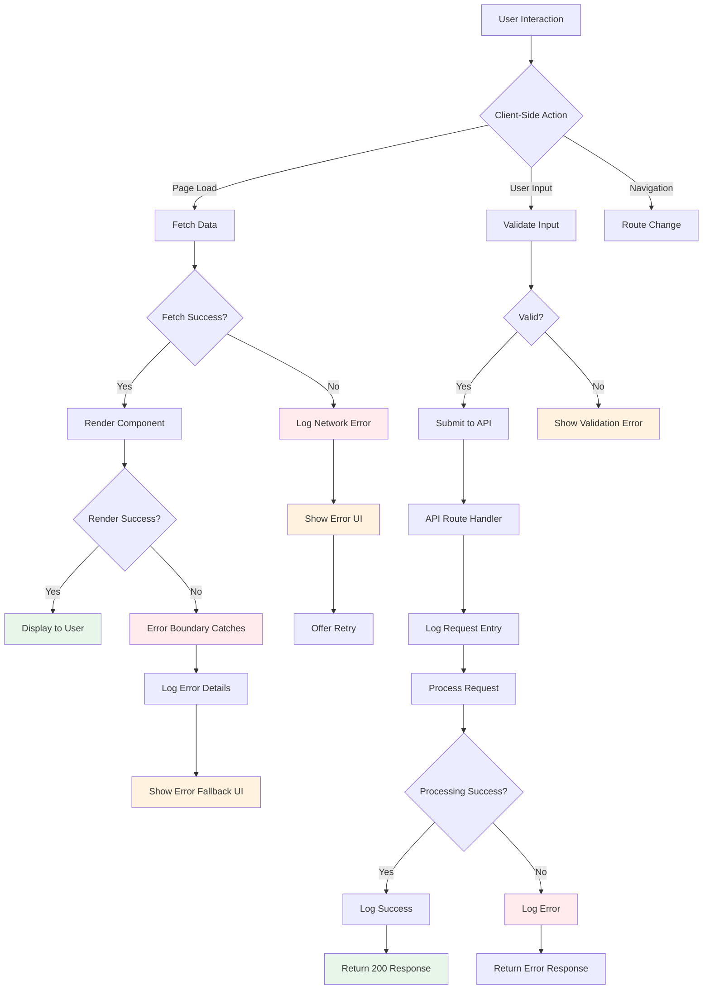
```mermaid
graph TD
    A[User Interaction] --> B{Client-Side Action}
    B -->|Page Load| C[Fetch Data]
    B -->|User Input| D[Validate Input]
    B -->|Navigation| E[Route Change]
    
    C --> F{Fetch Success?}
    F -->|Yes| G[Render Component]
    F -->|No| H[Log Network Error]
    H --> I[Show Error UI]
    I --> J[Offer Retry]
    
    D --> K{Valid?}
    K -->|Yes| L[Submit to API]
    K -->|No| M[Show Validation Error]
    
    L --> N[API Route Handler]
    N --> O[Log Request Entry]
    O --> P[Process Request]
    P --> Q{Processing Success?}
    Q -->|Yes| R[Log Success]
    Q -->|No| S[Log Error]
    R --> T[Return 200 Response]
    S --> U[Return Error Response]
    
    G --> V{Render Success?}
    V -->|Yes| W[Display to User]
    V -->|No| X[Error Boundary Catches]
    X --> Y[Log Error Details]
    Y --> Z[Show Error Fallback UI]
    
    style H fill:#ffebee
    style S fill:#ffebee
    style X fill:#ffebee
    style I fill:#fff3e0
    style M fill:#fff3e0
    style Z fill:#fff3e0
    style T fill:#e8f5e9
    style W fill:#e8f5e9
```

### 17.2 Debug Utility Architecture

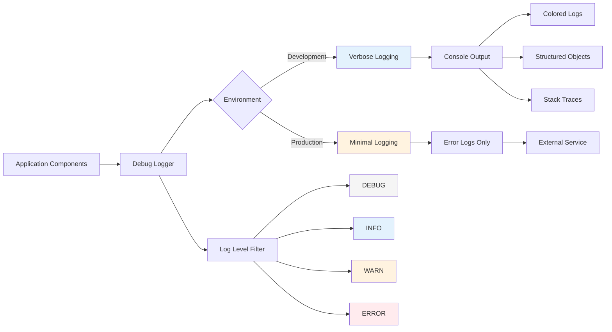
```mermaid
graph LR
    A[Application Components] --> B[Debug Logger]
    B --> C{Environment}
    C -->|Development| D[Verbose Logging]
    C -->|Production| E[Minimal Logging]
    
    D --> F[Console Output]
    F --> G[Colored Logs]
    F --> H[Structured Objects]
    F --> I[Stack Traces]
    
    E --> J[Error Logs Only]
    J --> K[External Service]
    
    B --> L[Log Level Filter]
    L --> M[DEBUG]
    L --> N[INFO]
    L --> O[WARN]
    L --> P[ERROR]
    
    style D fill:#e3f2fd
    style E fill:#fff3e0
    style M fill:#f5f5f5
    style N fill:#e3f2fd
    style O fill:#fff3e0
    style P fill:#ffebee
```

### 17.3 API Logging Data Flow

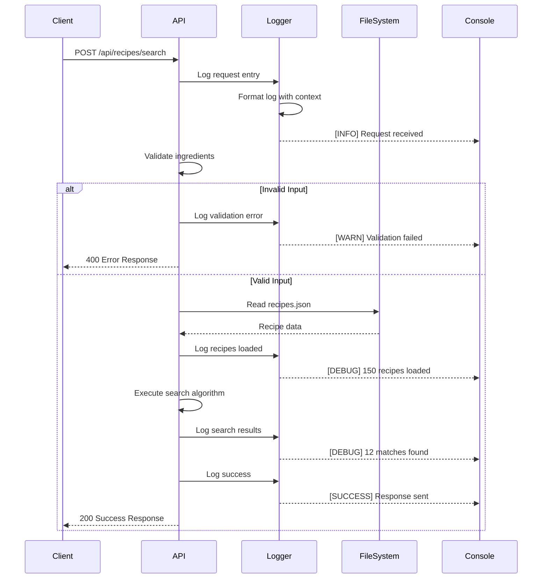
```mermaid
sequenceDiagram
    participant Client
    participant API
    participant Logger
    participant FileSystem
    
    Client->>API: POST /api/recipes/search
    API->>Logger: Log request entry
    Logger->>Logger: Format log with context
    Logger-->>Console: [INFO] Request received
    
    API->>API: Validate ingredients
    alt Invalid Input
        API->>Logger: Log validation error
        Logger-->>Console: [WARN] Validation failed
        API-->>Client: 400 Error Response
    else Valid Input
        API->>FileSystem: Read recipes.json
        FileSystem-->>API: Recipe data
        API->>Logger: Log recipes loaded
        Logger-->>Console: [DEBUG] 150 recipes loaded
        
        API->>API: Execute search algorithm
        API->>Logger: Log search results
        Logger-->>Console: [DEBUG] 12 matches found
        
        API->>Logger: Log success
        Logger-->>Console: [SUCCESS] Response sent
        API-->>Client: 200 Success Response
    end
```

### 17.4 Component Error Handling Pattern

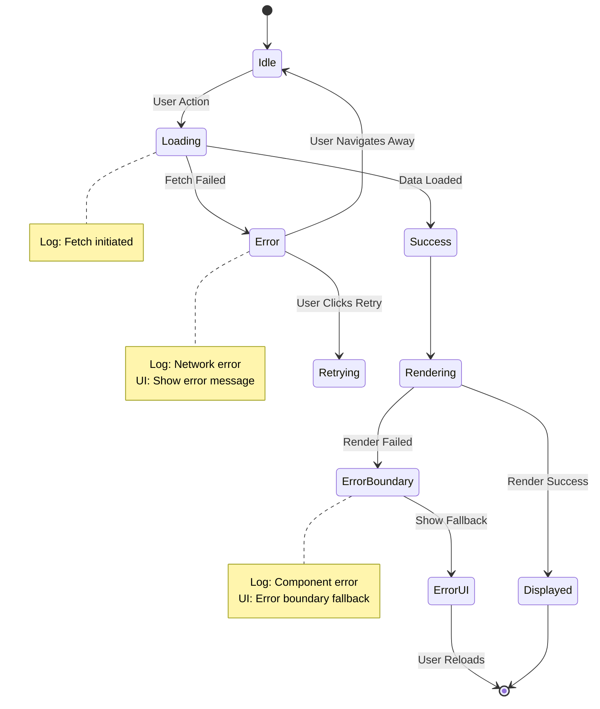
```mermaid
stateDiagram-v2
    [*] --> Idle
    Idle --> Loading: User Action
    Loading --> Success: Data Loaded
    Loading --> Error: Fetch Failed
    
    Success --> Rendering
    Rendering --> Displayed: Render Success
    Rendering --> ErrorBoundary: Render Failed
    
    Error --> Retrying: User Clicks Retry
    Error --> Idle: User Navigates Away
    
    ErrorBoundary --> ErrorUI: Show Fallback
    ErrorUI --> [*]: User Reloads
    
    Displayed --> [*]
    
    note right of Loading
        Log: Fetch initiated
    end note
    
    note right of Error
        Log: Network error
        UI: Show error message
    end note
    
    note right of ErrorBoundary
        Log: Component error
        UI: Error boundary fallback
    end note
```

### 17.5 Recipe ID Validation and Fuzzy Matching Flow

```mermaid
sequenceDiagram
    participant Client
    participant API
    participant Normalizer
    participant Matcher
    participant Logger
    
    Client->>API: GET /api/recipes/Recipe-001.json
    API->>Logger: Log raw ID received
    API->>Normalizer: Normalize ID
    
    Normalizer->>Normalizer: URL decode
    Normalizer->>Normalizer: Trim whitespace
    Normalizer->>Normalizer: Lowercase
    Normalizer->>Normalizer: Remove extension
    Normalizer-->>API: Normalized: "recipe-001"
    
    API->>Logger: Log normalized ID
    API->>Matcher: Find exact match
    
    alt Exact Match Found
        Matcher-->>API: Recipe found
        API->>Logger: Log success
        API-->>Client: 200 + Recipe data
    else No Exact Match
        Matcher->>Matcher: Try fuzzy matching
        alt Fuzzy Match Found
            Matcher-->>API: Similar recipe found
            API->>Logger: Log fuzzy match applied
            API-->>Client: 200 + Recipe data + Warning
        else No Match
            Matcher->>Matcher: Generate suggestions
            Matcher-->>API: No match, suggestions available
            API->>Logger: Log 404 with suggestions
            API-->>Client: 404 + Suggestions
        end
    end
```

### 17.6 UI-to-API-to-Data Flow with Error Propagation

```mermaid
sequenceDiagram
    participant User
    participant UI
    participant ErrorBoundary
    participant API
    participant FileSystem
    participant Logger
    
    User->>UI: Click "Search Recipes"
    UI->>Logger: Log search initiated
    UI->>UI: Set loading state
    
    UI->>API: POST /api/recipes/search
    API->>Logger: Log request entry
    
    API->>FileSystem: Read recipes.json
    
    alt File Read Success
        FileSystem-->>API: Recipe data
        API->>Logger: Log recipes loaded
        API->>API: Process search
        API->>Logger: Log processing steps
        API-->>UI: 200 + Results
        UI->>Logger: Log response received
        UI->>UI: Update state with results
        UI-->>User: Display recipes
    else File Read Error
        FileSystem-->>API: Error: ENOENT
        API->>Logger: Log file error
        API-->>UI: 500 + Error
        UI->>Logger: Log API error
        UI->>UI: Set error state
        UI-->>User: Show error message
    else Network Error
        API--xUI: Request timeout
        UI->>Logger: Log network error
        UI->>UI: Set error state
        UI-->>User: Show network error
    else Rendering Error
        UI->>UI: Attempt render
        UI--xErrorBoundary: Component error
        ErrorBoundary->>Logger: Log render error
        ErrorBoundary-->>User: Show error fallback
    end
```

### 17.7 Debug Mode Activation and Configuration Flow

```mermaid
flowchart TD
    Start([Application Start]) --> CheckEnv{Check ENV variables}
    
    CheckEnv -->|NEXT_PUBLIC_DEBUG_MODE=true| EnableDebug[Enable Debug Mode]
    CheckEnv -->|false/undefined| CheckLS{Check localStorage}
    
    CheckLS -->|smartmeal_debug=true| EnableDebug
    CheckLS -->|false/undefined| CheckQuery{Check URL params}
    
    CheckQuery -->|?debug=true| EnableDebug
    CheckQuery -->|none| NormalMode[Normal Mode]
    
    EnableDebug --> SetLevel{Set Log Level}
    SetLevel --> ConfigLogger[Configure Logger]
    ConfigLogger --> InitTransports[Initialize Transports]
    
    InitTransports --> ConsoleTransport[Console Output]
    InitTransports --> FileTransport[File Export - Optional]
    InitTransports --> RemoteTransport[Remote Service - Optional]
    
    ConsoleTransport --> ApplyFilters[Apply Context Filters]
    FileTransport --> ApplyFilters
    RemoteTransport --> ApplyFilters
    
    ApplyFilters --> LogReady[Logger Ready]
    NormalMode --> MinimalLog[Minimal Logging]
    
    LogReady --> AppRun([Application Running])
    MinimalLog --> AppRun
    
    style EnableDebug fill:#e8f5e9
    style NormalMode fill:#e3f2fd
    style LogReady fill:#c8e6c9
```

### 17.8 Error Monitoring Dashboard Data Flow

```mermaid
graph LR
    subgraph Application
        A[Frontend Errors] --> D[Error Logger]
        B[API Errors] --> D
        C[Server Errors] --> D
    end
    
    D --> E{Environment?}
    E -->|Development| F[Console Only]
    E -->|Production| G[External Service]
    
    G --> H[Sentry/LogRocket]
    H --> I[Error Aggregation]
    
    I --> J[Dashboard]
    
    J --> K[Error Rate Chart]
    J --> L[Top Errors List]
    J --> M[User Impact Report]
    J --> N[Performance Metrics]
    
    K --> O[Alert System]
    L --> O
    M --> O
    
    O --> P{Threshold Exceeded?}
    P -->|Yes| Q[Send Alert]
    P -->|No| R[Continue Monitoring]
    
    Q --> S[Email/Slack Notification]
    Q --> T[PagerDuty/On-call]
    
    style G fill:#e3f2fd
    style J fill:#e8f5e9
    style Q fill:#ffebee
```

### 17.9 Silent Failure Detection Pipeline

```mermaid
flowchart TD
    Start([Component Mount]) --> Setup[Setup Monitoring]
    
    Setup --> MonitorHydration[Monitor Hydration]
    Setup --> MonitorAsync[Monitor Async Operations]
    Setup --> MonitorStorage[Monitor localStorage]
    Setup --> MonitorProps[Monitor Prop Types]
    
    MonitorHydration --> H{Mismatch?}
    H -->|Yes| HLog[Log Hydration Warning]
    H -->|No| HPass[Continue]
    
    MonitorAsync --> A{Timeout?}
    A -->|Yes| ALog[Log Timeout]
    A -->|No| APass[Continue]
    
    MonitorStorage --> S{Parse Error?}
    S -->|Yes| SLog[Log + Reset Data]
    S -->|No| SPass[Continue]
    
    MonitorProps --> P{Type Mismatch?}
    P -->|Yes| PLog[Log + Coerce]
    P -->|No| PPass[Continue]
    
    HLog --> Report[Report to Dashboard]
    ALog --> Report
    SLog --> Report
    PLog --> Report
    
    Report --> Alert{Critical?}
    Alert -->|Yes| Notify[Alert Developer]
    Alert -->|No| Track[Track Metric]
    
    HPass --> Success
    APass --> Success
    SPass --> Success
    PPass --> Success
    
    Success([Healthy Operation])
    
    style HLog fill:#fff3e0
    style ALog fill:#ffebee
    style SLog fill:#fff3e0
    style PLog fill:#fff3e0
    style Notify fill:#ffebee
```

---

## 18. Configuration and Environment

### 18.1 Environment Variables for Debugging

**Proposed Environment Variables** (`.env.local`):

| Variable | Purpose | Default | Values |
|----------|---------|---------|--------|
| `NEXT_PUBLIC_DEBUG_MODE` | Enable verbose debugging | `false` | `true`, `false` |
| `NEXT_PUBLIC_LOG_LEVEL` | Minimum log level to display | `INFO` | `DEBUG`, `INFO`, `WARN`, `ERROR` |
| `NEXT_PUBLIC_ENABLE_ERROR_DETAILS` | Show error details in UI | `true` in dev | `true`, `false` |
| `API_LOG_REQUESTS` | Log all API requests | `true` in dev | `true`, `false` |

### 18.2 Debug Mode Activation

**Conditional Logging Based on Environment**:
- Check `process.env.NODE_ENV` for development detection
- Use `NEXT_PUBLIC_DEBUG_MODE` for runtime debug control
- Provide runtime toggle via localStorage (dev only)

**Example Debug Toggle**:
```
localStorage.setItem('smartmeal_debug', 'true');
// Reload page to activate verbose logging
```

---

## 19. Deliverables Summary

### 19.1 Code Deliverables

| Deliverable | Location | Description |
|-------------|----------|-------------|
| Debug Utility Library | `lib/debug.ts` | Centralized logging with color coding |
| Error Message Component | `components/common/ErrorMessage.tsx` | Reusable error UI with variants |
| Enhanced API Logging | `app/api/recipes/*/route.ts` | Entry/exit/error logging in all routes |
| Global Error Boundary | `app/layout.tsx` | Root-level error catching |
| Page Error Handling | `app/*/page.tsx` | Try-catch and error states in pages |
| API Testing Script | `scripts/testApiRoutes.js` | Automated API validation |

### 19.2 Documentation Deliverables

| Deliverable | Location | Description |
|-------------|----------|-------------|
| Debugging Guide | `docs/DEBUGGING_GUIDE.md` | User guide for debugging the app |
| API Testing Instructions | `docs/API_TESTING.md` | How to use test scripts |
| Error Handling Patterns | `docs/ERROR_PATTERNS.md` | Standard error handling examples |

### 19.3 Quick Testing Guide

**Testing All API Routes**:
```
npm run test:api
```

**Expected Output**:
- ✓ Recipe search with valid ingredients
- ✓ Recipe search with empty ingredients (400 error)
- ✓ Recipe detail with valid ID
- ✓ Recipe detail with invalid ID (404 error)

**Manual Testing Checklist**:
1. Navigate to `/recipes/nonexistent123` → Should show "Recipe Not Found"
2. Search with no matches → Should show "No recipes found" (not error)
3. Disable network → Should show network error with retry option
4. Check browser console → Logs should be color-coded and structured
5. Check server console → API logs should show request/response flow
6. Trigger error boundary → Should show fallback UI with error details

---

## 20. Data Models

### 20.1 Log Entry Structure

**TypeScript Interface** (conceptual):

```
LogEntry:
  - timestamp: ISO 8601 string
  - level: "DEBUG" | "INFO" | "WARN" | "ERROR" | "SUCCESS"
  - context: string (e.g., "API:RecipeSearch")
  - message: string
  - data?: object (structured metadata)
  - environment: "development" | "production"
```

### 20.2 Error State Structure

**TypeScript Interface** (conceptual):

```
ErrorState:
  - hasError: boolean
  - errorType: "network" | "notFound" | "validation" | "server" | "unknown"
  - message: string (user-friendly)
  - technicalDetails?: string (developer info)
  - timestamp: ISO 8601 string
  - retryable: boolean
  - retryCount?: number
```

### 20.3 API Response Structure (with Debug Meta)

**Development Response Example**:

```
APIResponse:
  - data: T (actual response payload)
  - meta?: object
    - timestamp: ISO 8601 string
    - processingTime: string (e.g., "45ms")
    - dataSource: string (e.g., "recipes.json")
    - resultCount?: number
    - debugInfo?: object (additional debug data)
```

---

## 21. Future Enhancements

### 21.1 Advanced Error Tracking
- Integration with error monitoring services (Sentry, LogRocket)
- Error rate dashboards
- Automated error alerting
- User session replay for error contexts

### 21.2 Performance Monitoring
- API response time tracking
- Component render time profiling
- Network waterfall analysis
- Core Web Vitals logging

### 21.3 User Feedback Integration
- Error report submission from UI
- User-provided context for errors
- Automatic screenshot capture on errors
- Error reproduction assistance

### 21.4 Automated Testing Expansion
- End-to-end error scenario testing
- Visual regression testing for error UIs
- API contract testing
- Load testing with error rate monitoring

---

## 22. Appendix

### 22.1 Related Documentation
- Next.js Error Handling: https://nextjs.org/docs/app/building-your-application/routing/error-handling
- React Error Boundaries: https://react.dev/reference/react/Component#catching-rendering-errors-with-an-error-boundary
- Console API: https://developer.mozilla.org/en-US/docs/Web/API/console

### 22.2 Glossary

| Term | Definition |
|------|------------|
| Error Boundary | React component that catches JavaScript errors in child components |
| Log Level | Severity categorization of log messages (DEBUG, INFO, WARN, ERROR) |
| Sanitization | Removing or redacting sensitive data from logs |
| Graceful Degradation | System continues functioning with reduced capability when errors occur |
| Retry Logic | Automatic re-attempt of failed operations with backoff strategy |
| Fallback UI | Alternative interface shown when primary component fails |
| Stack Trace | Call stack at the point where an error occurred |
| Context | Identifying information about where a log originated |
| Hydration | Process of attaching React to server-rendered HTML |
| Fuzzy Matching | Approximate string matching allowing for minor differences |
| Error Propagation | How errors move through error boundaries in component hierarchy |
| Silent Failure | Error that occurs without visible indication to user or developer |

---

## 23. Quick Reference Guide

### 23.1 Debug Activation Commands

**Enable Debug Mode:**
```
// Method 1: localStorage (Browser Console)
localStorage.setItem('smartmeal_debug', 'true')
localStorage.setItem('smartmeal_log_level', 'DEBUG')
location.reload()

// Method 2: Environment Variable (.env.local)
NEXT_PUBLIC_DEBUG_MODE=true
NEXT_PUBLIC_LOG_LEVEL=DEBUG

// Method 3: URL Parameter
http://localhost:3000?debug=true
```

**Filter Logs by Context:**
```
// Show only API logs
localStorage.setItem('debug_filter', 'API:*')

// Show only specific feature
localStorage.setItem('debug_filter', '*RecipeSearch*')

// Show multiple contexts
localStorage.setItem('debug_filter', 'API:*,Component:Recipe*')
```

### 23.2 Common Error Codes Quick Reference

| Code | Status | Meaning | User Action |
|------|--------|---------|-------------|
| `RECIPE_NOT_FOUND_INVALID_ID` | 404 | Recipe doesn't exist | Browse/search |
| `RECIPE_SEARCH_INVALID_INPUT` | 400 | Missing ingredients | Enter ingredients |
| `RECIPE_FILE_READ_ERROR` | 500 | Cannot load data | Retry/wait |
| `FILTER_INVALID_CUISINE` | 400 | Invalid filter | Select valid option |

### 23.3 Debug Workflow Cheat Sheet

**When investigating an issue:**

1. **Check Browser Console** (F12)
   - Look for red errors
   - Check log context tags
   - Note error stack trace

2. **Check Network Tab**
   - Verify API calls made
   - Check status codes
   - Review response bodies

3. **Check Server Logs**
   - Look for API route logs
   - Find matching request ID
   - Review processing steps

4. **Reproduce with Debug Mode**
   - Enable verbose logging
   - Repeat user action
   - Capture full log trail

5. **Analyze and Fix**
   - Identify root cause from logs
   - Apply appropriate fix
   - Verify fix works
   - Add preventive measures

### 23.4 Testing Commands

```bash
# Run API test suite
npm run test:api

# Run with verbose output
DEBUG=* npm run test:api

# Save test results to file
npm run test:api > test-results.txt

# Run development server with debug
NEXT_PUBLIC_DEBUG_MODE=true npm run dev
```

### 23.5 Key File Locations

| Purpose | File Path |
|---------|-----------|
| Debug Utility | `lib/debug.ts` |
| Error Message Component | `components/common/ErrorMessage.tsx` |
| Error Boundary | `components/common/ErrorBoundary.tsx` |
| API Search Route | `app/api/recipes/search/route.ts` |
| API Detail Route | `app/api/recipes/[id]/route.ts` |
| Test Script | `scripts/testApiRoutes.js` |
| REST Client Tests | `tests/api-tests.http` |
| Debugging Guide | `docs/DEBUGGING_GUIDE.md` |

---

**End of Document**
